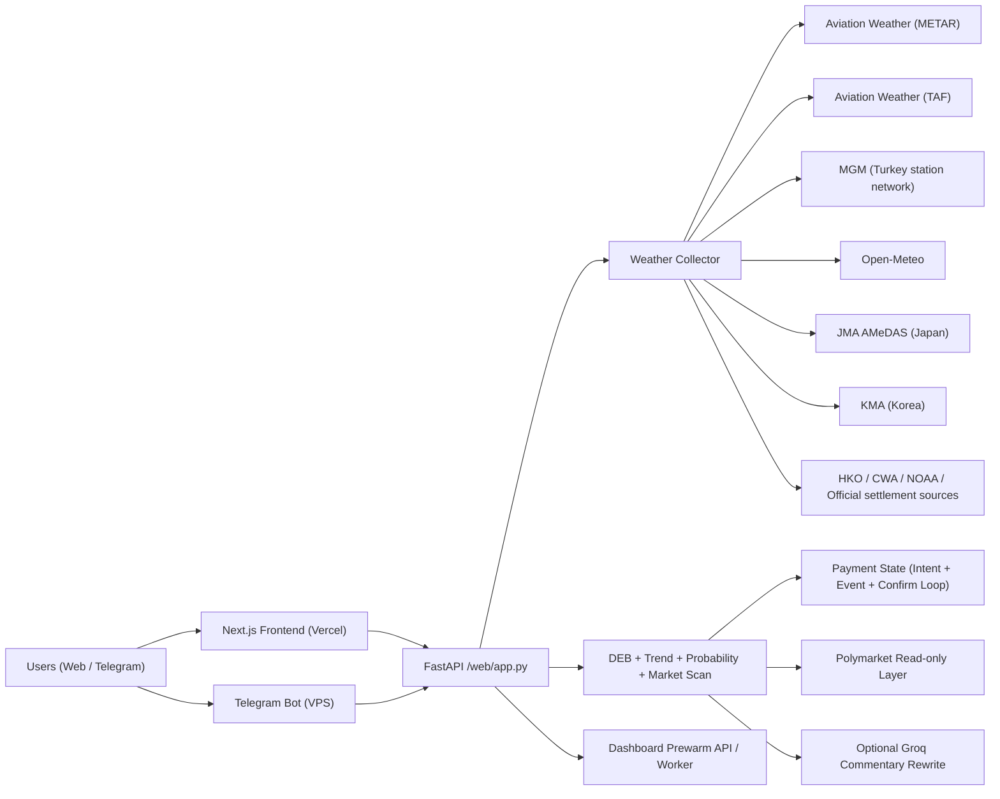

# PolyWeather Pro

Production weather-intelligence stack for temperature settlement markets.

Official dashboard: [polyweather-pro.vercel.app](https://polyweather-pro.vercel.app/)
中文说明: [README_ZH.md](README_ZH.md)

Public docs center: `/docs/intro` on the main site (bilingual product documentation, including intraday analysis, calibrated probability, model stack, TAF, settlement sources, history, and extension).

## Product Screenshots

### Global Dashboard


### City Analysis (Ankara)


## Star History

[](https://star-history.com/#yangyuan-zhen/PolyWeather&Date)

## Product Status (2026-04-27)

- Subscription live: `Pro Monthly 5 USDC`.
- Points redemption live: `500 points = 1 USDC`, max `3 USDC` off.
- Onchain checkout live: Polygon contract checkout (USDC / USDC.e).
- Auto-reconciliation live: event listener + periodic confirm loop.
- Ops dashboard live: `/ops` for memberships, leaderboard, manual point grants, and payment incident triage.
- Lightweight observability live: `/healthz`, `/api/system/status`, `/metrics`.
- Runtime state, cache, and core offline training/backfill flows now use SQLite as the primary path; legacy JSON/JSONL files remain only for migration, export, and explicit fallback input.
- EMOS/CRPS calibration is wired and trainable, but production should stay on `legacy` or `emos_shadow`; `emos_primary` is only for candidates that pass local offline evaluation and manual rollout.
- Intraday analysis is now positioned as a professional meteorology read: headline, confidence, base/upside/downside paths, next observation point, evidence chain, failure modes, and confirmation rules.
- Intraday modal now blocks stale cached detail during refresh, so users do not briefly trade off old city/date data before full detail arrives.
- City decision cards now include the AI airport read: METAR, DEB, model cluster, and the AI expected-high center are resolved before mapping the result to Polymarket temperature buckets.
- AI airport reads now use in-page memory cache, browser `localStorage`, and backend short-TTL cache; returning from another dashboard tab restores existing stream text or final results before any new request is needed.
- Market bucket matching now uses the full `all_buckets` surface and strict exact / range / or-higher / or-lower direction checks, reducing bad matches to unreasonable tail buckets.
- The card label “model-market difference” means `model probability - market-implied probability`; positive values indicate weather probability above market pricing, while negative values indicate the YES is already priced more fully.
- Calibrated model probability is now the primary probability panel. It shows the active production probability engine; EMOS/LGBM are surfaced only when evaluated or shadowed, while model consensus and market prices remain secondary references.
- Non-Hong Kong airport cities now ingest `TAF` and parse `FM / TEMPO / BECMG / PROB30/40`.
- Temperature chart now overlays `TAF Timing` markers near the expected peak window.
- Trade cue now combines upper-air structure, `TAF`, market crowding, and `edge_percent`.
- Browser extension now uses `DEB` for multi-day forecast and stays positioned as a lightweight lead-in to the main site.
- Official nearby-network layer now covers `MGM` (Turkey), `CMA/NMC` (Mainland China), `JMA AMeDAS` (Japan), `KMA` (Korea), `HKO` (Hong Kong), and `CWA` (Taiwan).
- Tokyo now ingests Haneda `JMA AMeDAS` 10-minute temperature as the official enhancement layer.
- Dashboard prewarm is now supported through a dedicated worker / cron path, with runtime status exposed in `/api/system/status` and `/ops`.
- `/ops` now exposes cache bucket counts, summary cache hit / miss rate, and prewarm runtime heartbeat.
- Intraday commentary can optionally use `Groq` as a bilingual rewrite layer, while rule-based commentary remains the fallback.
- Vercel frontend guidance now includes cost controls for analytics, eager fetches, and edge-side scanner blocking.

## License & Commercial Boundary

This repository is licensed under **GNU AGPL-3.0 only** from `2026-03-30` onward.

- Public in repo: weather aggregation, core analysis, dashboard, bot baseline, and standard payment flow.
- Not included in this repository: private production data, internal operating thresholds, commercial risk rules, pricing strategy details, and growth tooling.
- Trademark, brand, domain, production databases, and hosted-service operations are **not** granted by the code license.

See: [AGPL-3.0 & Commercial Boundary](docs/OPEN_CORE_POLICY.md)

## Core Capabilities

- Aggregates observations and forecasts for 52 monitored cities.
- Uses DEB (Dynamic Error Balancing) to blend multi-model highs.
- Generates settlement-oriented calibrated probability buckets (`mu` + bucket distribution), with `LGBM` metadata surfaced when the calibrated engine is active.
- Maps weather view to Polymarket quotes for mispricing scan.
- Adds city decision cards that combine AI airport reads, expected-high centers, full market-bucket mapping, and model-market difference in one view.
- Reuses one analysis core across web dashboard and Telegram bot.
- Adds payment audit trails, replay tooling, and incident visibility in ops.
- Adds peak-window-oriented intraday analysis with meteorology headline, path buckets, evidence chain, invalidation rules, and confirmation rules.
- Adds airport-side `TAF` timing overlays and airport suppression/disruption interpretation for non-Hong Kong airport cities.
- Adds official nearby-network enhancement layers for China, Japan, Korea, Hong Kong, Taiwan, and Turkey without replacing airport settlement anchors.
- Adds optional dashboard prewarm worker so hot cities can be refreshed before user clicks.

## Reference Architecture



## Monitored Cities (52)

- Europe / Middle East / Africa: Ankara, Istanbul, Moscow, London, Paris, Munich, Milan, Warsaw, Madrid, Tel Aviv, Amsterdam, Helsinki, Lagos, Cape Town, Jeddah
- APAC: Seoul, Busan, Hong Kong, Lau Fau Shan, Taipei, Shanghai, Beijing, Qingdao, Wuhan, Chengdu, Chongqing, Shenzhen, Guangzhou, Singapore, Tokyo, Kuala Lumpur, Jakarta, Manila, Wellington
- Americas: Toronto, New York, Los Angeles, San Francisco, Aurora, Austin, Houston, Chicago, Dallas, Miami, Atlanta, Seattle, Mexico City, Buenos Aires, Sao Paulo, Panama City
- South Asia: Lucknow, Karachi, Masroor Air Base

## Quick Start

### Backend + Bot (Docker)

```bash
docker compose up -d --build
```

### Frontend (local)

```bash
cd frontend
npm ci
npm run dev
```

## Recent Highlights

- Airport-linked contracts use the METAR / airport primary observing site as the settlement anchor. Wunderground pages are reference/history pages, not stations.
- Taipei and Shenzhen retain their explicitly configured station history pages for reconciliation, but the docs avoid describing Wunderground itself as a physical station.
- Hong Kong keeps `HKO` official readings in dashboard and history, without falling back to airport METAR lines.
- Intraday analysis now separates meteorology conclusion, evidence chain, invalidation rules, confirmation rules, calibrated probability, and market reference.
- `TAF` is used as an airport-side confirmation layer, not as the main temperature model.
- `LGBM` can power the calibrated probability panel; model vote counts remain an explanatory consensus line, not the final probability.
- Browser extension remains a lightweight monitoring + basic-bias product, while the site holds the full analysis experience.

## Runtime Data (Recommended on VPS)

Use external runtime storage to avoid SQLite/git conflicts:

```env
POLYWEATHER_RUNTIME_DATA_DIR=/var/lib/polyweather
POLYWEATHER_DB_PATH=/var/lib/polyweather/polyweather.db
POLYWEATHER_STATE_STORAGE_MODE=sqlite
```

## EMOS Local Training

Do not run full EMOS retraining on a small VPS. The VPS should collect data and load approved calibration files; training should run on a local/dev machine using a copied production SQLite database:

```powershell
scp root@38.54.27.70:/var/lib/polyweather/polyweather.db E:\web\PolyWeather\data\polyweather-prod.db
$env:POLYWEATHER_DB_PATH="E:\web\PolyWeather\data\polyweather-prod.db"
$env:POLYWEATHER_RUNTIME_DATA_DIR="E:\web\PolyWeather\artifacts\local_runtime"
python scripts\auto_retrain_probability_calibration.py --verbose --snapshot-limit 50000
```

Promote a generated `default.json` only when `auto_retrain_report.json` has `ready_for_promotion=true`, and prefer `emos_shadow` before enabling `emos_primary`.

## Ops Verification

### Health / system status / metrics

```bash
curl http://127.0.0.1:8000/healthz
curl http://127.0.0.1:8000/api/system/status
curl http://127.0.0.1:8000/metrics
```

### Dashboard prewarm worker

```bash
docker compose --profile workers up -d polyweather_prewarm
curl http://127.0.0.1:8000/api/system/status
```

Check:

- `prewarm.thread_alive`
- `prewarm.runtime.cycle_count`
- `cache.analysis.hit_rate`
- `cache.open_meteo_forecast_entries`

### Frontend cache headers

```bash
./scripts/validate_frontend_cache.sh "https://polyweather-pro.vercel.app"
```

### Payment auto-reconciliation logs

```bash
docker compose logs -f polyweather | egrep "payment event loop started|payment confirm loop started|payment auto-confirmed"
```

### Payment runtime

```bash
curl http://127.0.0.1:8000/api/payments/runtime
```

### Wallet activity logs

```bash
docker compose logs -f polyweather | egrep "polymarket wallet activity watcher started|wallet activity pushed"
```

## Telegram Commands

| Command | Purpose |
| :-- | :-- |
| `/city <name>` | City real-time analysis |
| `/deb <name>` | DEB historical reconciliation |
| `/top` | User leaderboard |
| `/id` | Show current chat ID |
| `/diag` | Startup diagnostics |
| `/help` | Help and usage |

## Documentation Index

- Chinese overview: [README_ZH.md](README_ZH.md)
- Chinese API guide: [docs/API_ZH.md](docs/API_ZH.md)
- TAF signal guide (ZH): [docs/TAF_SIGNAL_ZH.md](docs/TAF_SIGNAL_ZH.md)
- Model stack & DEB (ZH): [docs/MODEL_STACK_AND_DEB_ZH.md](docs/MODEL_STACK_AND_DEB_ZH.md)
- EMOS + LGBM system (ZH): [docs/EMOS_LGBM_SYSTEM_ZH.md](docs/EMOS_LGBM_SYSTEM_ZH.md)
- Commercialization: [docs/COMMERCIALIZATION.md](docs/COMMERCIALIZATION.md)
- AGPL-3.0 policy: [docs/OPEN_CORE_POLICY.md](docs/OPEN_CORE_POLICY.md)
- Supabase setup (ZH): [docs/SUPABASE_SETUP_ZH.md](docs/SUPABASE_SETUP_ZH.md)
- Configuration & secrets (ZH): [docs/CONFIGURATION_ZH.md](docs/CONFIGURATION_ZH.md)
- LightGBM daily-high model (ZH): [docs/LGBM_DAILY_HIGH_ZH.md](docs/LGBM_DAILY_HIGH_ZH.md)
- Frontend deployment (ZH): [docs/FRONTEND_DEPLOYMENT_ZH.md](docs/FRONTEND_DEPLOYMENT_ZH.md)
- Tech debt (EN): [docs/TECH_DEBT.md](docs/TECH_DEBT.md)
- Tech debt (ZH): [docs/TECH_DEBT_ZH.md](docs/TECH_DEBT_ZH.md)
- Payment verification: [docs/payments/POLYGONSCAN_VERIFY.md](docs/payments/POLYGONSCAN_VERIFY.md)
- Payment audit: [docs/payments/PAYMENT_AUDIT_ZH.md](docs/payments/PAYMENT_AUDIT_ZH.md)
- Payment V2 upgrade: [docs/payments/PAYMENT_UPGRADE_V2_ZH.md](docs/payments/PAYMENT_UPGRADE_V2_ZH.md)
- Ops admin guide: [docs/OPS_ADMIN_ZH.md](docs/OPS_ADMIN_ZH.md)
- Monitoring guide (ZH): [docs/MONITORING_ZH.md](docs/MONITORING_ZH.md)
- Deep research report: [docs/deep-research-report.md](docs/deep-research-report.md)
- Frontend report: [FRONTEND_REDESIGN_REPORT.md](FRONTEND_REDESIGN_REPORT.md)
- Release process: [RELEASE.md](RELEASE.md)
- Changelog: [CHANGELOG.md](CHANGELOG.md)

## Version

- Version: `v1.5.4`
- Last Updated: `2026-04-19`
