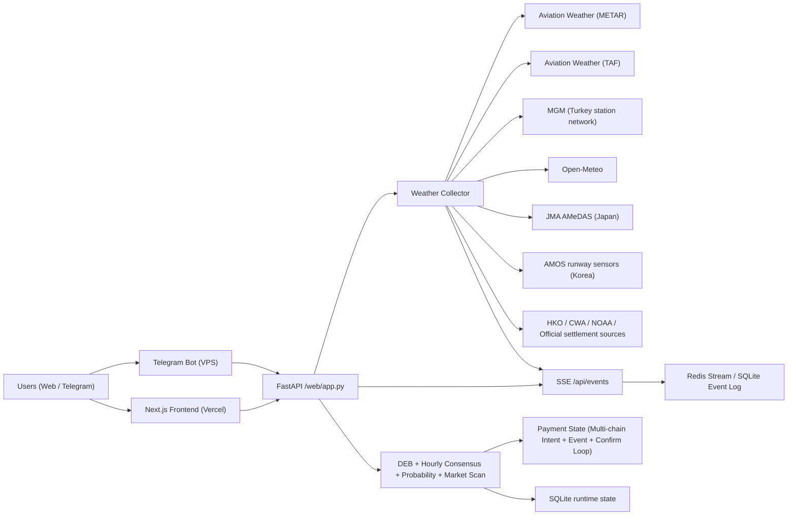

# PolyWeather Pro

Production weather-intelligence stack for temperature settlement markets.

Official dashboard: [polyweather.top](https://polyweather.top/)
中文说明: [README_ZH.md](README_ZH.md)

Public docs center: `/docs/intro` on the main site (bilingual product documentation, including intraday analysis, calibrated probability, model stack, TAF, settlement sources, history, and extension).

## Product Screenshots

### Realtime Terminal


### Telegram Runway Alerts


## Star History

[](https://star-history.com/#yangyuan-zhen/PolyWeather&Date)

## Product Status (2026-05-28)

- Subscription live: `Pro Monthly 10 USDC`.
- Points system live: earn via group chat, welcome bonus (+20), first-message-of-day bonus (+2), weekly participation rewards.
- `/city` and `/deb` now free (daily cap 10 each); points redeemable for payment discount (`500 pts = 1 USDC`, max `3 USDC`).
- Weekly leaderboard rewards restructured: smaller point bonuses for winners (200/100/50), all active users receive participation rewards.
- Onchain checkout live: Polygon contract checkout (USDC / USDC.e) plus Ethereum mainnet USDC direct-transfer confirmation.
- Auto-reconciliation live: event listener + periodic confirm loop.
- Ops dashboard live: `/ops` for memberships, leaderboard, manual point grants, and payment incident triage.
- Lightweight observability live: `/healthz`, `/api/system/status`, `/metrics`.
- Realtime terminal live: visible city charts subscribe through `/api/events?cities=...&since_revision=...`, receive `city_observation_patch.v1` SSE patches, and replay short gaps from Redis Stream in production or SQLite fallback in local/single-node mode.
- Chart refresh is observation-driven: live patches merge into the current chart without a loading overlay; only visible charts run a 60s no-patch fallback, and returning from a background browser tab triggers a foreground catch-up refresh.
- Temperature charts default to All Day, keep an optional Peak window derived from the DEB hourly path, and render all timestamps in the selected city's local time.
- The chart core has been split into focused logic/canvas/state modules; Recharts now receives explicit measured dimensions to avoid 0x0 rendering and disappearing curves.
- DEB hourly consensus (`deb_hourly_consensus.v1`) is now the preferred hourly forecast path for peak-window detection and chart overlays; DEB remains a forecast curve, never an observation source.
- Legacy Gaussian probability is rendered as horizontal probability bands and a `mu` reference line on the chart, rather than as a fake time-series curve.
- Settlement runway curves are visible by default for AMSC/AMOS cities; the configured settlement runway is highlighted and auxiliary runways are shown as secondary context.
- Hong Kong uses CoWIN station `6087` (Po Leung Kuk Choi Kai Yau School) as the 1-minute reference-station curve, with HKO 10-minute observations kept as the official meteorological layer.
- Telegram airport/runway pushes are bilingual by default and use settlement-endpoint runway temperatures for slope/current/summary copy.
- Runtime state, cache, and core offline training/backfill flows now use SQLite as the primary path; legacy JSON/JSONL files remain only for migration, export, and explicit fallback input.
- EMOS/CRPS calibration is wired and trainable, but production should stay on `legacy` or `emos_shadow`; `emos_primary` is only for candidates that pass local offline evaluation and manual rollout.
- Intraday analysis is now positioned as a professional meteorology read: headline, confidence, base/upside/downside paths, next observation point, evidence chain, failure modes, and confirmation rules.
- Intraday modal now blocks stale cached detail during refresh, so users do not briefly trade off old city/date data before full detail arrives.
- Terminal city cards now combine settlement observations, DEB hourly consensus, model cluster context, calibrated probability, and market-bucket mapping without blocking the chart on AI text generation.
- Terminal data uses page memory cache, browser `localStorage`, backend short-TTL cache, SSE patch replay, and foreground refresh so returning from another tab restores the latest visible chart state quickly.
- Market bucket matching now uses the full `all_buckets` surface and strict exact / range / or-higher / or-lower direction checks, reducing bad matches to unreasonable tail buckets.
- The card label “model-market difference” means `model probability - market-implied probability`; positive values indicate weather probability above market pricing, while negative values indicate the YES is already priced more fully.
- Calibrated model probability is now the primary probability panel. It shows the active production probability engine (legacy Gaussian or EMOS), while model consensus remains a secondary reference.
- Non-Hong Kong airport cities now ingest `TAF` and parse `FM / TEMPO / BECMG / PROB30/40`.
- Temperature chart now overlays `TAF Timing` markers near the expected peak window.
- Trade cue now combines upper-air structure, `TAF`, market crowding, and `edge_percent`.
- Browser extension now uses `DEB` for multi-day forecast and stays positioned as a lightweight lead-in to the main site.
- Official nearby-network layer now covers `MGM` (Turkey), `CMA/NMC` (Mainland China), `JMA AMeDAS` (Japan), `AMOS` (Korea, runway-level, Seoul/Busan), `HKO` (Hong Kong), and `CWA` (Taiwan).
- Tokyo now ingests Haneda `JMA AMeDAS` 10-minute temperature as the official enhancement layer.
- Frontend design system overhauled: unified CSS token system, eliminated `!important` abuse (134→49 in light theme), consolidated breakpoints (18→10), migrated hardcoded colors to CSS variables, added ARIA attributes and focus-visible keyboard navigation. See `docs/frontend-ui-design-review.md` for the full audit trail.

## License & Commercial Boundary

This repository is licensed under **GNU AGPL-3.0 only** from `2026-03-30` onward.

- Public in repo: weather aggregation, core analysis, dashboard, bot baseline, and standard payment flow.
- Not included in this repository: private production data, internal operating thresholds, commercial risk rules, pricing strategy details, and growth tooling.
- Trademark, brand, domain, production databases, and hosted-service operations are **not** granted by the code license.

See: [AGPL-3.0 & Commercial Boundary](docs/OPEN_CORE_POLICY.md)

## Core Capabilities

- Aggregates observations and forecasts for 51 monitored cities.
- Uses DEB (Dynamic Error Balancing) to blend multi-model highs.
- Builds a DEB-weighted hourly consensus path for peak-window logic and chart display.
- Generates settlement-oriented calibrated probability buckets (`mu` + bucket distribution) via legacy Gaussian or EMOS/CRPS calibration.
- Adds city decision cards that combine live observations, expected-high centers, full market-bucket mapping, and model-market difference in one view.
- Reuses one analysis core across web dashboard and Telegram bot.
- Adds payment audit trails, replay tooling, and incident visibility in ops.
- Adds peak-window-oriented intraday analysis with meteorology headline, path buckets, evidence chain, invalidation rules, and confirmation rules.
- Adds airport-side `TAF` timing overlays and airport suppression/disruption interpretation for non-Hong Kong airport cities.
- Adds official nearby-network and runway-level enhancement layers for China, Japan, Korea (AMOS runway sensors for Seoul/Busan), Hong Kong, Taiwan, and Turkey without replacing airport settlement anchors.

## Reference Architecture



## Monitored Cities (51)

- Europe / Middle East / Africa: Ankara, Istanbul, Moscow, London, Paris, Munich, Milan, Warsaw, Madrid, Tel Aviv, Amsterdam, Helsinki, Lagos, Cape Town, Jeddah
- APAC: Seoul, Busan, Hong Kong, Lau Fau Shan, Taipei, Shanghai, Beijing, Qingdao, Wuhan, Chengdu, Chongqing, Shenzhen, Guangzhou, Singapore, Tokyo, Kuala Lumpur, Jakarta, Manila, Wellington
- Americas: Toronto, New York, Los Angeles, San Francisco, Aurora, Austin, Houston, Chicago, Dallas, Miami, Atlanta, Seattle, Mexico City, Buenos Aires, Sao Paulo, Panama City
- South Asia: Lucknow, Karachi

## Quick Start

### Backend + Bot (Docker)

```bash
docker compose up -d --build
```

### Frontend (local)

```bash
cd frontend
npm ci
npm run dev
```

## Recent Highlights

- Airport-linked contracts use the METAR / airport primary observing site as the settlement anchor. Wunderground pages are reference/history pages, not stations.
- Taipei and Shenzhen retain their explicitly configured station history pages for reconciliation, but the docs avoid describing Wunderground itself as a physical station.
- Hong Kong keeps `HKO` official readings in dashboard and history, without falling back to airport METAR lines.
- Intraday analysis now separates meteorology conclusion, evidence chain, invalidation rules, confirmation rules, calibrated probability, and market reference.
- `TAF` is used as an airport-side confirmation layer, not as the main temperature model.
- Calibrated probability uses legacy Gaussian (default) or EMOS/CRPS when evaluated; model vote counts remain an explanatory consensus line, not the final probability.
- Browser extension remains a lightweight monitoring + basic-bias product, while the site holds the full analysis experience.
- Realtime terminal charts use SSE patches plus replayable event storage; full HTTP detail remains the authoritative snapshot.
- Chart observations are shown in the city's local time, not the browser timezone.

## Runtime Data (Recommended on VPS)

Use external runtime storage to avoid SQLite/git conflicts:

```env
POLYWEATHER_RUNTIME_DATA_DIR=/var/lib/polyweather
POLYWEATHER_DB_PATH=/var/lib/polyweather/polyweather.db
POLYWEATHER_STATE_STORAGE_MODE=sqlite
POLYWEATHER_EVENT_STORE=redis
POLYWEATHER_REDIS_URL=redis://polyweather_redis:6379/0
POLYWEATHER_REDIS_STREAM_MAXLEN=50000
POLYWEATHER_REDIS_REQUIRED=true
```

For local development or a strict single-process fallback, keep `POLYWEATHER_EVENT_STORE=sqlite`.

## EMOS Local Training

Do not run full EMOS retraining on a small VPS. The VPS should collect data and load approved calibration files; training should run on a local/dev machine using a copied production SQLite database:

```powershell
scp root@38.54.27.70:/var/lib/polyweather/polyweather.db E:\web\PolyWeather\data\polyweather-prod.db
$env:POLYWEATHER_DB_PATH="E:\web\PolyWeather\data\polyweather-prod.db"
$env:POLYWEATHER_RUNTIME_DATA_DIR="E:\web\PolyWeather\artifacts\local_runtime"
python scripts\auto_retrain_probability_calibration.py --verbose --snapshot-limit 50000
```

Promote a generated `default.json` only when `auto_retrain_report.json` has `ready_for_promotion=true`, and prefer `emos_shadow` before enabling `emos_primary`.

## Ops Verification

### Health / system status / metrics

```bash
curl http://127.0.0.1:8000/healthz
curl http://127.0.0.1:8000/api/system/status
curl http://127.0.0.1:8000/metrics
```

### Frontend cache headers

```bash
./scripts/validate_frontend_cache.sh "https://polyweather.top"
```

### Payment auto-reconciliation logs

```bash
docker compose logs -f polyweather | egrep "payment event loop started|payment confirm loop started|payment auto-confirmed"
```

### Payment runtime

```bash
curl http://127.0.0.1:8000/api/payments/runtime
```

### Payment chains

Production payment routes are configured by the backend. Polygon remains the default checkout-contract chain, while Ethereum mainnet USDC can be enabled as a direct-transfer route so users who pay on their wallet default network are still confirmed by `intent.chain_id`.

## Telegram Commands

| Command | Purpose |
| :-- | :-- |
| `/city <name>` | City real-time analysis |
| `/deb <name>` | DEB historical reconciliation |
| `/top` | User leaderboard |
| `/id` | Show current chat ID |
| `/diag` | Startup diagnostics |
| `/help` | Help and usage |

## Documentation Index

- Chinese overview: [README_ZH.md](README_ZH.md)
- Chinese API guide: [docs/API_ZH.md](docs/API_ZH.md)
- TAF signal guide (ZH): [docs/TAF_SIGNAL_ZH.md](docs/TAF_SIGNAL_ZH.md)
- Model stack & DEB (ZH): [docs/MODEL_STACK_AND_DEB_ZH.md](docs/MODEL_STACK_AND_DEB_ZH.md)
- Commercialization: [docs/COMMERCIALIZATION.md](docs/COMMERCIALIZATION.md)
- AGPL-3.0 policy: [docs/OPEN_CORE_POLICY.md](docs/OPEN_CORE_POLICY.md)
- Supabase setup (ZH): [docs/SUPABASE_SETUP_ZH.md](docs/SUPABASE_SETUP_ZH.md)
- Configuration & secrets (ZH): [docs/CONFIGURATION_ZH.md](docs/CONFIGURATION_ZH.md)
- Frontend deployment (ZH): [docs/FRONTEND_DEPLOYMENT_ZH.md](docs/FRONTEND_DEPLOYMENT_ZH.md)
- Tech debt (ZH): [docs/TECH_DEBT_ZH.md](docs/TECH_DEBT_ZH.md)
- Airport realtime sources: [docs/AIRPORT_REALTIME_SOURCES.md](docs/AIRPORT_REALTIME_SOURCES.md)
- Airport market monitor (ZH): [docs/AIRPORT_MARKET_MONITOR_ZH.md](docs/AIRPORT_MARKET_MONITOR_ZH.md)
- Services overview (ZH): [docs/SERVICES_ZH.md](docs/SERVICES_ZH.md)
- Payment verification: [docs/payments/POLYGONSCAN_VERIFY.md](docs/payments/POLYGONSCAN_VERIFY.md)
- Payment audit: [docs/payments/PAYMENT_AUDIT_ZH.md](docs/payments/PAYMENT_AUDIT_ZH.md)
- Payment V2 upgrade: [docs/payments/PAYMENT_UPGRADE_V2_ZH.md](docs/payments/PAYMENT_UPGRADE_V2_ZH.md)
- Ops admin guide: [docs/OPS_ADMIN_ZH.md](docs/OPS_ADMIN_ZH.md)
- Monitoring guide (ZH): [docs/MONITORING_ZH.md](docs/MONITORING_ZH.md)
- Deep research report: [docs/deep-research-report.md](docs/deep-research-report.md)
- Release process: [RELEASE.md](RELEASE.md)
- Changelog: [CHANGELOG.md](CHANGELOG.md)

## Version

- Version: `v1.8.1`
- Last Updated: `2026-05-28`
