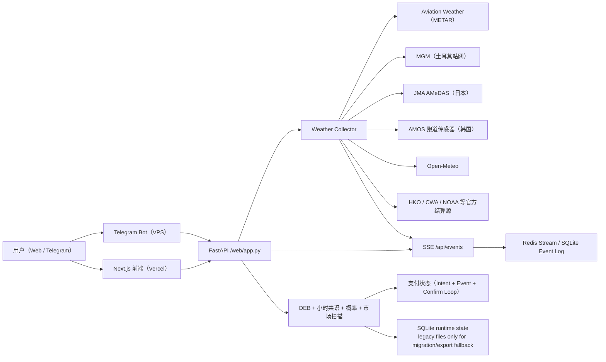

# PolyWeather Pro

面向温度结算市场的生产级气象情报系统。

官方看板：[polyweather.top](https://polyweather.top/)

## 产品截图

### 实时终端


### Telegram 跑道推送


## 当前产品状态（2026-05-29）

- 已上线订阅制：`Pro 月付 10 USDC`。
- 已上线积分体系：群内发言赚分 + 首次发言欢迎奖励 (+20) + 每日首条消息奖励 (+2) + 每周全员参与奖。
- `/city` 与 `/deb` 已改为免费（每日各 10 次）；积分可用于支付抵扣（`500 分 = 1 USDC`，最多抵 `3 USDC`）。
- 周榜奖励已改造：降低赢家积分加成 (200/100/50)，所有周活跃用户均享参与奖。
- 已上线链上支付：Polygon 合约支付（USDC / USDC.e）+ Ethereum 主网 USDC 直转确认。
- 已上线自动补单：事件监听 + 周期确认双链路。
- 已上线支付运行态与审计接口：`/api/payments/runtime`。
- 已上线轻量运营后台：`/ops`（会员、周榜、补分、支付异常单）。
- 已上线轻量可观测性：`/healthz`、`/api/system/status`、`/metrics`。
- 已补最小外部监控栈：Prometheus + Alertmanager + Grafana + Telegram 告警 relay。
- 实时终端已切换到可重放事件流：可见城市图表通过 `/api/events?cities=...&since_revision=...` 订阅 `city_observation_patch.v1`，生产环境使用 Redis Stream 做短窗口 replay，本地/单进程可回退 SQLite event log。
- 图表刷新由实测事件驱动：SSE patch 直接合并到当前曲线，不弹 loading 遮罩；只有可见图表启用 60 秒无 patch 兜底，浏览器后台返回前台时会主动补齐最新 detail。
- 城市图表默认展示“全天”，可选“高温”窗口由 DEB hourly path 推导；所有图表横轴都按城市当地时间展示，不按用户浏览器时区。
- 核心图表组件已拆分为逻辑、状态与 canvas 渲染模块；Recharts 使用 `ResizeObserver` 后的明确宽高，规避 0x0 渲染和长时间挂页后曲线消失。
- DEB hourly consensus（`deb_hourly_consensus.v1`）已作为峰值窗口和图表 DEB 曲线的优先小时路径；DEB 仍然是预测曲线，不作为实测来源。
- legacy 高斯概率在图表上展示为概率温度带和 `mu` 参考线，不再伪装成一条时间序列曲线。
- AMSC/AMOS 城市的结算跑道曲线默认展示并高亮，辅助跑道作为弱化曲线保留；釜山单跑道只展示 `SR/SL` 结算跑道，不再重复显示 AMOS 聚合线。
- 香港默认展示 CoWIN `6087`（保良局陈守仁小学）1 分钟参考站曲线，HKO 10 分钟实测保留为官方气象层。
- Telegram 机场/跑道推送默认中英文双语，并统一使用结算端点跑道温度计算当前值、15 分钟趋势和文案。
- 运行态状态、缓存与核心离线训练/回填链路已完成 SQLite 主路径收口；legacy JSON/JSONL 仅保留给迁移、导出与显式回退输入。
- EMOS/CRPS 校准链路已接通，但生产主概率保持 `legacy` 或 `emos_shadow`；`emos_primary` 只在本地离线评估通过并手动灰度后启用。
- 官方增强站网已统一接入：
  - `MGM`（土耳其）
  - `CMA/NMC`（中国内地）
  - `JMA AMeDAS`（日本）
  - `AMOS`（韩国，跑道级传感器，首尔/釜山）
  - `HKO`（香港）
  - `CWA`（台湾）
- 东京现已接入羽田 `JMA AMeDAS` 10 分钟温度作为官方增强层。
- 已支持 Dashboard 定向预热 worker / cron 路径，运行态在 `/api/system/status` 与 `/ops` 可见。
- `/ops` 现已展示缓存桶数量、summary cache hit/miss 与运行态 heartbeat。
- 今日日内分析已改为“专业气象判断台”：顶部先给气象主判断、置信度、基准/上修/下修路径、下一观测点，再展示证据链、失效条件、确认条件和模型层。
- 日内分析弹窗在 full detail / market detail 同步完成前会锁住旧内容并显示刷新状态，避免用户短暂看到上一轮缓存数据后误判。
- 终端城市卡已改为结构化实况 + DEB hourly consensus + 多模型集群 + 校准概率 + 市场温度桶，不再让图表等待 AI 文案生成。
- 终端数据同时使用页面内存缓存、浏览器 `localStorage`、后端短 TTL 缓存、SSE patch replay 和前台恢复刷新；从其他选项卡切回时会优先恢复最新可见图表状态。
- 市场温度桶匹配已改为完整 `all_buckets` 映射，按 exact / range / or higher / or lower 方向严格匹配，避免把天气中枢错配到不合理尾部桶。
- 决策卡中的“模型-市场差”口径为 `模型概率 - 市场隐含概率`，正值表示天气概率高于市场报价，负值表示市场已经更充分计价。
- 概率区已改为”校准模型概率”；默认展示生产概率引擎输出（legacy 高斯或 EMOS），模型共识作为辅助参考。
- 今日日内结构解读以规则与结构化信号为主，AI 文案只作为可降级辅助层，不替代实测、DEB、TAF 或结算逻辑。
- 前端设计系统全面重构：统一 CSS token 体系、消除 !important 滥用（134→49）、合并断点（18→10）、数百处硬编码颜色迁移至 CSS 变量、添加 ARIA 无障碍属性和键盘导航。完整审查记录见 `docs/frontend-ui-design-review.md`。

## 许可证与商用边界（重要）

本仓库自 `2026-03-30` 起采用 **GNU AGPL-3.0-only**。

- 仓库公开部分：天气聚合、基础分析、前端看板、Bot 基础能力、标准支付流程。
- 不包含在仓库中的部分：生产私有数据、商业风控规则、运营阈值、收费策略细节、内部对账与增长工具。
- 商标、品牌、域名、生产数据库与托管服务运营能力，不因代码许可证一并授权。

详细见：[AGPL-3.0 与商用边界](docs/OPEN_CORE_POLICY.md)

## 核心能力

- 聚合 51 个监控城市的实测与预报数据。
- DEB（Dynamic Error Balancing）融合多模型最高温。
- 构建 DEB 加权小时共识曲线，用于峰值窗口判断和图表默认 DEB 展示。
- 输出结算导向校准概率分布（`mu` + 温度桶），通过 legacy 高斯或 EMOS/CRPS 校准引擎。
- 地图城市决策卡把结构化实况、最高温中枢、完整市场温度桶和模型-市场差放在同一张卡中展示。
- Web 仪表盘与 Telegram Bot 复用同一分析内核。
- 支付链路具备事件重放、SQLite 审计事件与 RPC 容灾能力。
- 官方增强层与跑道级传感器支持按国家 provider 统一接入（含韩国 AMOS 首尔/釜山跑道实测），不替代机场主站、METAR 或明确官方结算站。

## 参考架构



## 监控城市（51）

- 欧洲/中东/非洲：Ankara、Istanbul、Moscow、London、Paris、Munich、Milan、Warsaw、Madrid、Tel Aviv、Amsterdam、Helsinki、Lagos、Cape Town、Jeddah
- 亚太：Seoul、Busan、Hong Kong、Lau Fau Shan、Taipei、Shanghai、Beijing、Wuhan、Chengdu、Chongqing、Shenzhen、Guangzhou、Singapore、Tokyo、Kuala Lumpur、Jakarta、Manila、Wellington
- 美洲：Toronto、New York、Los Angeles、San Francisco、Aurora、Austin、Houston、Chicago、Dallas、Miami、Atlanta、Seattle、Mexico City、Buenos Aires、Sao Paulo、Panama City
- 南亚：Lucknow、Karachi

## 快速启动

### 后端 + Bot（Docker）

```bash
docker compose up -d --build
```

### 前端本地运行

```bash
cd frontend
npm ci
npm run dev
```

## 运行数据目录（VPS 推荐）

建议将运行态数据放到仓库外（避免 `git pull` 被 SQLite 卡住）：

```env
POLYWEATHER_RUNTIME_DATA_DIR=/var/lib/polyweather
POLYWEATHER_DB_PATH=/var/lib/polyweather/polyweather.db
POLYWEATHER_STATE_STORAGE_MODE=sqlite
POLYWEATHER_EVENT_STORE=redis
POLYWEATHER_REDIS_URL=redis://polyweather_redis:6379/0
POLYWEATHER_REDIS_STREAM_MAXLEN=50000
POLYWEATHER_REDIS_REQUIRED=true
```

本地开发或严格单进程兜底可使用 `POLYWEATHER_EVENT_STORE=sqlite`。

## EMOS 本地训练流程

低配 VPS 只负责采集、服务和加载已通过评估的参数，不建议在 VPS 上跑 EMOS 全量训练。训练前先从 VPS 拉 SQLite 副本到本地：

```powershell
scp root@38.54.27.70:/var/lib/polyweather/polyweather.db E:\web\PolyWeather\data\polyweather-prod.db
```

本地训练：

```powershell
$env:POLYWEATHER_DB_PATH="E:\web\PolyWeather\data\polyweather-prod.db"
$env:POLYWEATHER_RUNTIME_DATA_DIR="E:\web\PolyWeather\artifacts\local_runtime"
python scripts\auto_retrain_probability_calibration.py --verbose --snapshot-limit 50000
```

只有 `auto_retrain_report.json` 中 `ready_for_promotion=true` 时，才允许把候选 `default.json` 传回 VPS，并优先以 `emos_shadow` 观察。

## 运维验收

### 健康与系统状态

```bash
curl http://127.0.0.1:8000/healthz
curl http://127.0.0.1:8000/api/system/status
curl http://127.0.0.1:8000/metrics
```

### 外部监控栈

```bash
./scripts/validate_frontend_cache.sh "https://polyweather.top"
```

### 支付自动补单日志

```bash
docker compose logs -f polyweather | egrep "payment event loop started|payment confirm loop started|payment auto-confirmed"
```

### 外部监控栈

```bash
docker compose --profile monitoring up -d polyweather_prometheus polyweather_alertmanager polyweather_alert_relay polyweather_grafana
```

- Prometheus：`http://127.0.0.1:${POLYWEATHER_PROMETHEUS_PORT:-9090}`
- Alertmanager：`http://127.0.0.1:${POLYWEATHER_ALERTMANAGER_PORT:-9093}`
- Grafana：`http://127.0.0.1:${POLYWEATHER_GRAFANA_PORT:-3001}`

手动巡检：

```bash
python scripts/check_ops_health.py --base-url http://127.0.0.1:8000
```

### 支付运行态

```bash
curl http://127.0.0.1:8000/api/payments/runtime
```

### 运营后台

- 前端入口：`https://polyweather.top/ops`
- 后端需配置：

```env
POLYWEATHER_OPS_ADMIN_EMAILS=yhrsc30@gmail.com
```

## Telegram 指令

| 指令 | 用途 |
| :-- | :-- |
| `/city <name>` | 城市实时分析 |
| `/deb <name>` | DEB 历史对账 |
| `/top` | 用户积分排行 |
| `/id` | 查看聊天 Chat ID |
| `/diag` | Bot 启动诊断 |
| `/help` | 帮助与用法 |

## 文档索引

- 英文总览：[README.md](README.md)
- API 文档（中文）：[docs/API_ZH.md](docs/API_ZH.md)
- 商业化说明：[docs/COMMERCIALIZATION.md](docs/COMMERCIALIZATION.md)
- AGPL-3.0 边界：[docs/OPEN_CORE_POLICY.md](docs/OPEN_CORE_POLICY.md)
- Supabase 接入：[docs/SUPABASE_SETUP_ZH.md](docs/SUPABASE_SETUP_ZH.md)
- 配置与密钥管理：[docs/CONFIGURATION_ZH.md](docs/CONFIGURATION_ZH.md)
- 前端部署（Vercel）：[docs/FRONTEND_DEPLOYMENT_ZH.md](docs/FRONTEND_DEPLOYMENT_ZH.md)
- 技术债：[docs/TECH_DEBT_ZH.md](docs/TECH_DEBT_ZH.md)
- 机场实时数据源：[docs/AIRPORT_REALTIME_SOURCES.md](docs/AIRPORT_REALTIME_SOURCES.md)
- 机场市场监控（中文）：[docs/AIRPORT_MARKET_MONITOR_ZH.md](docs/AIRPORT_MARKET_MONITOR_ZH.md)
- 外部服务总览：[docs/SERVICES_ZH.md](docs/SERVICES_ZH.md)
- 支付合约验证：[docs/payments/POLYGONSCAN_VERIFY.md](docs/payments/POLYGONSCAN_VERIFY.md)
- 支付审计说明：[docs/payments/PAYMENT_AUDIT_ZH.md](docs/payments/PAYMENT_AUDIT_ZH.md)
- 支付 V2 升级方案：[docs/payments/PAYMENT_UPGRADE_V2_ZH.md](docs/payments/PAYMENT_UPGRADE_V2_ZH.md)
- 运营后台说明：[docs/OPS_ADMIN_ZH.md](docs/OPS_ADMIN_ZH.md)
- 外部监控说明：[docs/MONITORING_ZH.md](docs/MONITORING_ZH.md)
- 模型栈与 DEB：[docs/MODEL_STACK_AND_DEB_ZH.md](docs/MODEL_STACK_AND_DEB_ZH.md)
- 深度评估报告：[docs/deep-research-report.md](docs/deep-research-report.md)
- 发布流程：[RELEASE.md](RELEASE.md)
- 变更记录：[CHANGELOG.md](CHANGELOG.md)

## 当前版本

- 版本：`v1.8.1`
- 文档最后更新：`2026-05-28`
