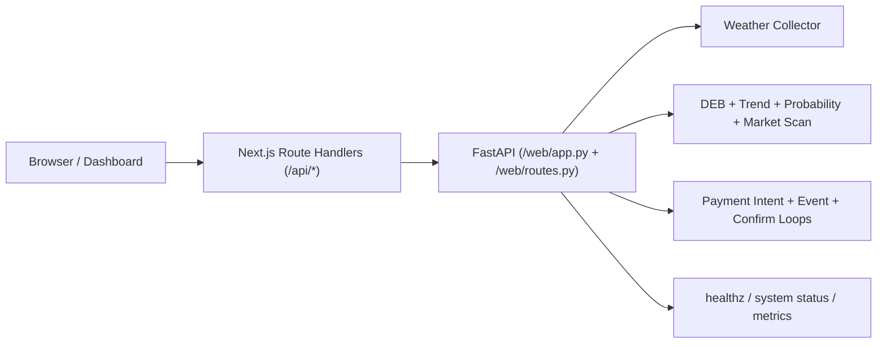

# PolyWeather API 文档（v1.8.0）

最后更新：`2026-04-27`

本文档描述当前对外可用 API 口径（`web/app.py` + `web/routes.py` + `frontend/app/api/*`）。

## 1. 基础信息

- 后端直连：`http://127.0.0.1:8000`
- 前端 BFF：`https://polyweather-pro.vercel.app/api/*`
- 返回格式：`application/json`

## 2. 请求链路



## 3. 天气分析接口

| 接口 | 方法 | 用途 |
| :-- | :-- | :-- |
| `/api/cities` | GET | 监控城市列表 |
| `/api/city/{name}` | GET | 城市主分析 |
| `/api/city/{name}/summary` | GET | 轻量摘要 |
| `/api/city/{name}/detail` | GET | 聚合详情（含 market_scan） |
| `/api/history/{name}` | GET | 历史对账 |

### `GET /api/city/{name}/detail`

可选参数：

- `force_refresh=true|false`
- `market_slug=<slug>`
- `target_date=YYYY-MM-DD`

重点字段：

- `market_scan.available`
- `market_scan.signal_label`
- `market_scan.edge_percent`
- `market_scan.anchor_model / anchor_high / anchor_settlement`
- `market_scan.yes_buy / no_buy`
- `market_scan.primary_market.tradable`
- `probabilities.engine / calibration_mode / calibration_version`
- `probabilities.raw_mu / raw_sigma / calibrated_mu / calibrated_sigma`
- `probabilities.shadow_distribution`
- `intraday_meteorology.headline / confidence`
- `intraday_meteorology.base_case_bucket / upside_bucket / downside_bucket`
- `intraday_meteorology.next_observation_time`
- `intraday_meteorology.invalidation_rules / confirmation_rules / signal_contributions`
- `peak.first_h / peak.last_h / peak.status`
- `vertical_profile_signal.heating_setup / suppression_risk / trigger_risk / mixing_strength`
- `taf.signal.peak_window / suppression_level / disruption_level / markers`

### 城市决策卡市场层口径

- 前端会请求完整 `market_scan` / `all_buckets`，而不是只取 lite 结果。
- 温度桶匹配按今日预计最高温中枢映射，并区分 exact、range、or higher、or lower，避免把 30°C 附近的天气中枢误配到不合理尾部桶。
- `模型-市场差 = 模型概率 - 市场隐含概率`。正值表示天气概率高于市场报价；负值表示市场已经更充分计价。
- 温度桶标签会统一规范化 `C/F/°C/°F`，避免前端重复显示单位。

### `detail` 新增结构信号说明

`/api/city/{name}/detail` 现在会返回一组更偏交易场景的结构字段：

#### 1. `intraday_meteorology`

今日日内分析的专业气象判断层。该字段只做派生，不改变路由和缓存策略。

重点字段：

- `headline`：今日主判断，例如“峰值仍有上修空间 / 峰值受云雨压制”
- `confidence`：`low | medium | high`
- `base_case_bucket`：基准温度档位
- `upside_bucket`：上修路径档位
- `downside_bucket`：下修路径档位
- `next_observation_time`：下一次应重点看的本地时间
- `invalidation_rules`：2-4 条失效条件
- `confirmation_rules`：1-3 条确认条件
- `signal_contributions`：气象因子列表，含 `label`、`direction`、`strength`、`summary`

前端如果该字段暂缺，会降级使用现有 `paceView`、`boundaryRiskView`、`upperAirCue`、`probabilitySummary` 等字段。

#### 2. `probabilities`

概率层基于 legacy 高斯分桶，以 DEB 融合预测 μ 和 ensemble spread σ 生成 1°C 粒度概率分布。

概率字段：

- `engine`：固定为 `legacy`
- `mu`：DEB 融合预测中心值
- `distribution`：当天合约桶概率分布
- `distribution_all`：包含外围桶的完整分布

#### 3. `detail_depth`

`detail_depth` 用于区分轻量 detail 与完整 detail。前端如果发现：

- `detail_depth != "full"`
- 或 `forecast.daily` 只有当天一张卡
- 或模型层只剩单模型

会触发强刷完整 detail，并在 UI 上显示同步状态 / 占位卡，避免用户把中间态误判成完整分析。

#### 4. `peak`

- `first_h`：预计峰值窗口起始小时
- `last_h`：预计峰值窗口结束小时
- `status`：`before_peak | near_peak | after_peak`

这组字段用于让日内结构信号围绕真实峰值窗口分析，而不是固定只看下午。

#### 5. `vertical_profile_signal`

重点字段：

- `source`
- `window`
- `cape_max`
- `cin_min`
- `lifted_index_min`
- `boundary_layer_height_max`
- `shear_10m_180m_max`
- `suppression_risk`
- `trigger_risk`
- `mixing_strength`
- `shear_risk`
- `heating_setup`
- `heating_score`
- `summary_zh`
- `summary_en`

这组字段对应前端“高空结构信号 / Upper-Air Structure”卡片。

#### 6. `taf.signal`

仅对**非香港机场城市**启用。当前已支持解析：

- `FM`
- `TEMPO`
- `BECMG`
- `PROB30`
- `PROB40`

重点字段：

- `peak_window`
- `segments`
- `markers`
- `suppression_level`
- `disruption_level`
- `wind_shift`
- `summary_zh`
- `summary_en`

`markers` 会被前端温度走势图拿来做 `TAF 时段 / TAF Timing` 标记。

#### 7. 结算锚点口径

- 多数机场市场以 `METAR` / 机场主站实况为结算锚点。
- `Wunderground` 是历史页面或参考入口，不应在产品文案里被描述成“站”。
- `MGM / NMC / JMA / AMOS / HKO / CWA` 等官方站网属于增强层或明确官方站点层；只有合约规则明确指定时，才作为最终结算站点。

## 4. 鉴权与账户接口

| 接口 | 方法 | 用途 |
| :-- | :-- | :-- |
| `/api/auth/me` | GET | 当前登录态、积分、订阅状态 |

`/api/auth/me` 关键字段：

- `authenticated`
- `user_id`, `email`
- `points`, `weekly_points`, `weekly_rank`
- `subscription_active`, `subscription_plan_code`, `subscription_expires_at`

## 5. 支付接口

| 接口 | 方法 | 用途 |
| :-- | :-- | :-- |
| `/api/payments/config` | GET | 支付配置、代币列表、套餐、积分抵扣规则 |
| `/api/payments/runtime` | GET | 支付运行态、RPC 状态、event loop 状态、最近审计事件 |
| `/api/payments/wallets` | GET | 当前用户已绑定钱包 |
| `/api/payments/wallets/challenge` | POST | 获取绑定签名 challenge |
| `/api/payments/wallets/verify` | POST | 提交签名并绑定钱包 |
| `/api/payments/intents` | POST | 创建支付意图（intent） |
| `/api/payments/intents/{intent_id}` | GET | 查询 intent 最新状态 |
| `/api/payments/intents/{intent_id}/submit` | POST | 提交交易哈希 |
| `/api/payments/intents/{intent_id}/confirm` | POST | 手动触发确认 |
| `/api/payments/reconcile-latest` | POST | 对当前登录用户最近一笔 intent 做恢复性确认 |

### 支付状态建议

前端流程建议：

1. `POST /intents`
2. 钱包发链上交易
3. `POST /submit`
4. `POST /confirm`
5. 若 pending，轮询 `GET /intents/{id}` 直到 `confirmed`

## 6. 运维与观测接口

| 接口 | 方法 | 用途 |
| :-- | :-- | :-- |
| `/healthz` | GET | 基础健康检查 |
| `/api/system/status` | GET | 系统状态、功能开关、rollout 状态、轻量指标摘要 |
| `/metrics` | GET | Prometheus 风格指标导出 |

`/api/system/status` 当前会包含：

- `features.state_storage_mode`
- `probability.decision`
- `probability.ready_for_primary`
- `metrics`

`/metrics` 当前会导出：

- `polyweather_http_requests_total`
- `polyweather_http_request_duration_ms_*`
- `polyweather_source_requests_total`
- `polyweather_source_request_duration_ms_*`

## 7. Ops 管理接口

这些接口主要给 `/ops` 管理后台使用，默认要求：

- 已登录
- 当前邮箱位于 `POLYWEATHER_OPS_ADMIN_EMAILS`

| 接口 | 方法 | 用途 |
| :-- | :-- | :-- |
| `/api/ops/users` | GET | 按 Telegram ID / 用户名 / 邮箱查询用户 |
| `/api/ops/leaderboard/weekly` | GET | 本周积分榜 |
| `/api/ops/memberships` | GET | 当前有效会员（已按用户去重，保留最晚到期） |
| `/api/ops/users/grant-points` | POST | 手动补分 |
| `/api/ops/payments/incidents` | GET | 支付异常单（仅 `payment_intent_failed`） |
| `/api/ops/payments/incidents/{event_id}/resolve` | POST | 标记支付异常单已处理 |

`/api/ops/payments/incidents` 当前支持：

- `reason=<receiver_mismatch|sender_mismatch|event_mismatch|tx_reverted>`
- 默认不返回已标记处理的记录
- 重点用于排查“已付款未开通”“打到旧收款地址”等事故
## 8. 缓存策略（当前）

- `cities` / `summary` / `history`：BFF 支持 `ETag + 304`
- `summary?force_refresh=true`：`Cache-Control: no-store`
- 详情接口与支付接口：`no-store`
- `METAR` / `TAF` / settlement current 由后端各自维护短 TTL 缓存
- 前端打开今日日内分析时，如果 full detail 或 market scan 正在同步，会先显示刷新锁，不展示可交互的旧内容
- 城市决策卡 AI 解读前端缓存键为 `city + local_date + locale + METAR signature`；signature 优先使用原始 METAR，缺失时回退到报文时间、观测时间和温度
- 城市决策卡 AI 解读使用两层前端缓存：页面内存缓存保存 loading / 流式进度 / 最终 payload，`localStorage` 保存最终成功 payload，默认 TTL 1 小时
- 后端城市 AI 缓存不使用 `local_time` 作为 key，避免同一观测因当前时钟变化反复失效
- 城市市场扫描完整桶缓存按 `city + local_date + full` 存储，默认 TTL 10 分钟

## 9. 调试示例

### 查询未来日期 market_scan

```bash
curl -s "http://127.0.0.1:8000/api/city/ankara/detail?force_refresh=true&target_date=2026-03-12"
```

### 校验支付配置

```bash
curl -s http://127.0.0.1:8000/api/payments/config | python3 -m json.tool
```

### 查看支付运行态

```bash
curl -s http://127.0.0.1:8000/api/payments/runtime | python3 -m json.tool
```

### 查看支付异常单

```bash
curl -s "http://127.0.0.1:8000/api/ops/payments/incidents?reason=receiver_mismatch" | python3 -m json.tool
```

### 查看系统状态

```bash
curl -s http://127.0.0.1:8000/api/system/status | python3 -m json.tool
```

### 观察支付自动补单

```bash
docker compose logs -f polyweather | egrep "payment event loop started|payment confirm loop started|payment auto-confirmed"
```

## 10. AGPL 与公开口径说明

本仓库代码自 `2026-03-30` 起采用 `AGPL-3.0-only`。对外公开文档仅覆盖通用 API 契约；生产商业策略参数、私有运营阈值与托管服务能力不在公开文档披露。

详见：[AGPL-3.0 与商用边界](OPEN_CORE_POLICY.md)
