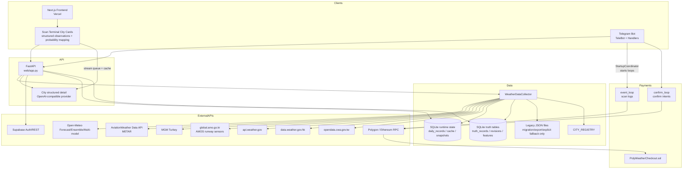

# PolyWeather 深度评估与改进提案报告

## 执行摘要

PolyWeather（仓库：`yangyuan-zhen/PolyWeather`）定位为**面向温度类结算预测市场（如 Polymarket 的温度结算合约）**的”生产级气象情报系统”，核心在于把多源天气观测/预报转化为**结算导向的概率桶（μ + bucket distribution）**；同时提供 Web 仪表盘与 Telegram Bot 两套交互入口，并包含 Polygon 链上 USDC/USDC.e 支付、Ethereum 主网 USDC 直转确认、自动补单与订阅/积分体系。项目 README 现明确仓库代码采用 `AGPL-3.0-only`，同时将品牌、商标、生产私有数据与运营阈值保留在代码许可证之外。

> **2026-05-29 更新**：支付 intent 已支持多链 `chain_id`，Polygon 继续承载 checkout 合约，Ethereum 主网 USDC 作为直转确认通道；终端图表继续使用 HTTP snapshot + SSE Patch + Redis Stream/SQLite replay 架构。
## 项目概览

PolyWeather 的目标与范围在 README/README_ZH 中定义得较清楚：为温度结算市场提供气象情报（多源采集→融合→概率→对照市场报价），并提供“官方看板（Vercel 前端）+ VPS 后端 + Telegram Bot”。
项目主功能可归纳为五层：
**天气层（数据源/采集）**：聚合 51 个城市的实测与预报；支持 AviationWeather METAR/TAF、韩国 AMOS 跑道级观测（首尔/釜山）、中国 AMSC AWOS 跑道端点气温、香港 CoWIN 6087 / HKO、土耳其 MGM、Open-Meteo 多模型与集合预报、美国 MADIS HFMETAR 等。机场类市场仍以 METAR / 机场主站或明确官方结算源为锚点，Wunderground 不描述为物理观测站。
**分析层（DEB/趋势/概率/结算口径）**：
DEB（Dynamic Error Balancing）基于过去 N 天模型误差（MAE）倒数加权，输出融合预报；运行态仍维护近 14 天 `daily_records` 缓存做当前对账，但长期监督真值与训练特征已经迁到 SQLite 永久表中，并支持基于 WU（Weather Underground 口径）四舍五入的结算命中评估。
趋势/概率引擎在 `trend_engine.py` 中实现：综合“集合预报区间→σ/μ→高温窗口→死盘判定→温度桶概率分布→边界提示”等，用于 bot 展示与 web 结构化数据输出。
**城市决策层（Scan Terminal / 结构化实况层）**：地图点击城市后加入城市决策卡，前端拉取 full detail、多模型区间、最新 METAR/官方站点/跑道观测，并通过 `/api/city/{name}/detail` 生成城市级结构化数据。终端图表使用 HTTP snapshot + SSE patch + Redis/SQLite replay，最高温中枢优先使用 DEB hourly consensus，再结合多模型中心、日内 pace 和当前实测。
**市场层（Polymarket 行情对照）**：*[v1.7.0 已移除]* 原先从 Gamma API 发现市场、从 CLOB 读取价格/盘口并计算”模型-市场差”，已于 2026-05-23 随 Polymarket 价格拉取层一并删除。当前 `market_scan` 返回空。
**商业化与支付**：订阅（`Pro Monthly 10 USDC`）、积分抵扣、Polygon 链上收款合约（USDC/USDC.e）、Ethereum 主网 USDC 直转确认，并提供“事件监听 + 周期确认”的自动补单机制。
**支持的数据集/数据源**：项目不是传统“训练数据集+模型训练”的机器学习仓库；其“数据集”本质是外部实时/预报 API 与站点观测数据。对外部数据的使用需要遵守来源方的访问与速率限制，例如 AviationWeather Data API 明确限制请求频率（含每分钟请求上限/建议降低频率与使用缓存文件）。
**许可证**：仓库根目录 `LICENSE` 当前为 `AGPL-3.0-only`。同时 README 与策略文档明确：品牌、商标、生产私有数据与运营策略不随代码许可证一并授权。
（插图：项目 README 中包含产品截图，可用于快速理解实时终端与 Telegram 推送形态）

## 架构与代码库分析

### 代码库模块地图

从 README、Docker/Compose、入口脚本与核心模块引用关系，可以抽象出如下模块地图（按“运行时组件”与“Python 域模块”两层描述）：
| 层级 | 目录/文件 | 角色定位 | 关键说明 |
| ------------- | ------------------------------------------------------------------------ | ------------------------------ | ---------------------------------------------------------------------------------------------------------------------------------------------------------------------------- |
| 运行时组件 | `frontend/` | Next.js 前端（Vercel） | 前端重构报告提到 App Router、Route Handlers（BFF）、缓存策略、支付与账户中心等；Scan Terminal 已新增城市决策卡、结构化实况层、页面内存/localStorage 双层缓存、structured detail 小并发队列与完整市场桶映射。 |
| 运行时组件 | `web/app.py` + `web/core.py` + `web/routes.py` + `web/analysis_service.py` + `web/scan_terminal_service.py` | FastAPI 后端 API | 已从单文件入口拆为启动入口、核心上下文、路由层、分析服务层；Scan Terminal 侧提供 `/api/city/{name}/detail`，城市结构化分析 默认 30s 超时并支持 stream parse failure 的非流式重试。 |
| 运行时组件 | `bot_listener.py` + `src/bot/*` | Telegram Bot | 入口 `bot_listener.py` 调 `start_bot()`，并由 `StartupCoordinator` 启动多个后台 loop。 |
| Python 域模块 | `src/data_collection/*` | 天气采集 + 城市注册 | 采集层已拆为 `weather_sources.py` 编排层 + `open_meteo_cache.py`、`settlement_sources.py`、`metar_sources.py`、`mgm_sources.py`、`amos_station_sources.py`、`jma_amedas_sources.py`、`nws_open_meteo_sources.py`、`country_networks.py` 等。v1.7.0 已移除 NMC、pogodaiklimat、Meteoblue 数据源。 |
| Python 域模块 | `src/analysis/*` | DEB/趋势/概率/结算口径 | `deb_algorithm.py`、`trend_engine.py`、`settlement_rounding.py`。 |
| Python 域模块 | `src/payments/*` + `contracts/*` | 支付合约 + 事件监听/补单 | Solidity 合约 + Python 侧事件扫描/确认循环 + SQLite 审计事件 + RPC 多节点容灾 + 合约静态检查。 |
| Python 域模块 | `src/auth/*`、`docs/SUPABASE_SETUP_ZH.md`、`scripts/supabase/schema.sql` | Supabase 鉴权/订阅/积分 | 使用 `/auth/v1/user` 校验 JWT、`/rest/v1/subscriptions` 查订阅（服务端角色 key 必须保密）。 |
| Python 域模块 | `src/database/runtime_state.py` | 运行态状态、永久真值与训练特征仓储 | 已接入 `daily_records`、`telegram_alert_state`、`probability_training_snapshots`、`open_meteo` 持久缓存，并新增永久真值表、真值修订审计表、长期训练特征表。 |
| 工程与运维 | `docker-compose.yml`、`Dockerfile`、`.github/workflows/ci.yml`、`scripts/*` | 部署/验证脚本 | 现已具备 CI 门禁、迁移脚本、状态校验脚本、配置校验脚本与 rollout 报告脚本。 |

### 参考架构与关键工作流

项目 README 给出了一版 mermaid 参考架构图（Web/Telegram→FastAPI→采集→分析→支付/市场层）。 在此基础上，结合 `StartupCoordinator` 的 loop 启动与支付监听逻辑，可补充一个更“运行时视角”的架构图：

### 城市决策卡工作流（2026-05 更新）

Scan Terminal 的城市决策卡现在承担“从天气分析到市场动作解释”的前端决策层：

1. **地图点击与 pinned city**：免费/付费入口都会先把城市加入决策卡；未付费用户若权限不足，仍应保留卡片承载升级/限制提示，而不是点击后无反馈。
2. **full detail hydration**：卡片请求城市 full detail，拿到 DEB、当前/历史实测、多模型区间与最新 METAR。现阶段 detail hydration 仍偏保守串行，优先保障后端数据源稳定；真正消耗 LLM 的 结构化解读另行限流。
3. **结构化实况层**：前端最多同时保留 2 条城市结构化分析 stream，第三个及以后城市会进入队列并展示排队提示，避免多个 provider stream 同时竞争导致第三城/第四城解析失败。当前临时使用 MiMo：`POLYWEATHER_API_BASE_URL=<backend>`、`POLYWEATHER_SCAN_TERMINAL_PAYLOAD_TTL_SEC=300`；其他后端城市结构化分析 配置建议为 `POLYWEATHER_SCAN_TERMINAL_BUILD_TIMEOUT_SEC=120`、`POLYWEATHER_SCAN_TERMINAL_MAX_WORKERS=8`、`POLYWEATHER_SCAN_TERMINAL_PAYLOAD_TTL_SEC=300`。
4. **缓存策略**：页面内存缓存保留 loading/stream/final 状态，切换选项卡返回时不应空白重拉；localStorage 持久化最终成功、非 degraded 的 payload；后端 city AI cache key 已移除当前 `local_time` 干扰，主要按城市、日期与 METAR signature 失效。
5. **市场桶匹配**：城市市场扫描必须使用 full `all_buckets`，按温度 exact/range/“or higher”/“or lower” 方向严格匹配；不再用宽松 ±8°C fallback，以避免拿到 16°C 之类错误桶。前端展示统一使用“模型-市场差”，即 `model_probability - market_implied_probability`，并修复温度单位重复渲染（如 `31°°C`）。

### 依赖与运行环境

**Python 依赖**：`requirements.txt` 包含 `requests`、`loguru`、`pyTelegramBotAPI`、`python-dotenv`、`numpy`、`web3`、`fastapi`、`uvicorn` 等，符合“采集+bot+api+链上交互”的需求。
**容器环境**：`Dockerfile` 基于 `python:3.11-slim`，默认启动 bot；`docker-compose.yml` 通过不同 command 分别启动 bot 与 web（`python bot_listener.py` / `python web/app.py`），并挂载运行态数据目录。
**前端依赖**：前端 README 描述 Next.js、Leaflet、Recharts、Supabase Auth、WalletConnect 等；`frontend/package.json` 是前端依赖来源。
### 数据预处理、模型与“训练/推理”管线

本项目的“模型”主要是统计融合与规则/启发式引擎，而非深度网络训练：
**天气数据预处理**：`WeatherDataCollector` 内部做了大量“输入清洗+缓存+退避”的工程处理：
包含 Open-Meteo 三类缓存（forecast/ensemble/multi_model）、429 冷却期、最小调用间隔、磁盘持久化缓存文件（重启后避免冷启动打爆 API）、以及 METAR/结算源缓存。
**DEB（Dynamic Error Balancing）**：以最近 N 天各模型的 MAE 计算倒数权重并做加权融合；同时将 `forecasts / actual_high / deb_prediction / mu / prob_snapshot` 写入 `data/daily_records.json`，并提供命中率/MAE/Brier 等统计口径。
**概率引擎**：`trend_engine.py` 以集合预报的 p10/p90 推 σ（并考虑历史 MAE floor、风向/云量/压强的 shock_score、以及峰值窗口 time-decay），再用正态近似把连续分布映射为 WU 整数“温度桶概率”。
**推理流水线（在线）**：
Web/Telegram 请求 → FastAPI 调用采集器抓取/复用缓存 → 分析引擎输出结构化结果（μ、概率桶、趋势、死盘/窗口判定、DEB 预测、市场扫描）→ 前端渲染或 bot 消息格式化。对城市决策卡而言，在线推理还会叠加“latest METAR + 多模型区间 + structured city detail + full all_buckets 市场匹配”，最终输出最高温中枢、结构化实况层和模型-市场差。
**检查点（checkpoints）**：传统 ML checkpoint 不适用；但项目现已形成两类“业务状态 checkpoint”：
（a）SQLite 运行态存储（当前线上与核心离线链路主路径）；（b）SQLite 永久真值/训练特征表（当前监督真值与训练样本长期主存）；（c）legacy JSON/JSONL 文件（主要保留给迁移回滚、导出比对与显式回退输入）。当前设计仍支持 `POLYWEATHER_STATE_STORAGE_MODE=file|dual|sqlite`，但对线上部署与离线训练/回填而言，推荐目标状态都已经是 `sqlite`。
### 测试、CI/CD 与运维验证

**测试**：仓库存在 `tests/test_trend_engine.py`，覆盖 μ 计算、死盘判定、预报崩盘提示、趋势方向等核心逻辑（通过 patch 隔离外部依赖）。前端侧已通过 `npm run build` 验证 Scan Terminal 改动可以编译；后续仍建议为城市决策卡补固定 fixture，覆盖 `all_buckets` 匹配、温度单位渲染、AI 缓存 key 与 stream 队列行为。
**CI/CD**：已补齐 GitHub Actions 工作流，至少覆盖 Python lint/test、前端 build、Docker build 三条门禁；当前缺口不再是“有没有 CI”，而是“是否已在 GitHub 分支保护中强制执行”。
**部署/更新**：Compose 用于启动服务；另有 `update.sh` 通过 `pkill` + `nohup` 重启 bot 与 web。
## 优势与薄弱点

### 优势

**产品闭环完整、目标明确**：从“天气→结算→市场→错价信号→付费体系（订阅/积分/链上支付）”形成可商业化闭环，并在 README 清晰列出当前产品状态（订阅、积分抵扣、链上支付、自动补单等已上线）。2026-05 完成积分制度改造：`/city` `/deb` 改为免费（每日各 10 次），新增首次发言欢迎奖励与每日首条消息奖励，周奖励降低赢家积分差距并增加全员参与奖。
**复用一套分析内核服务多端**：趋势/概率/DEB 等核心逻辑被抽成分析模块，并被 web 与 bot 共用，避免“两套逻辑漂移”。前端城市决策卡在此基础上补足“机场报文解释 + 市场桶动作口径”，让用户从地图点击可以直接进入可解释决策。
**面向外部 API 的工程防护意识较强**：Open-Meteo 429 冷却期、最小调用间隔、磁盘缓存、缓存 TTL 等措施表明作者已遭遇并处理速率限制与冷启动问题。 同时 AviationWeather 官方文档也明确建议控制频率并可使用 cache 文件降低负载，项目后续可进一步对齐最佳实践。
**支付侧有“事件监听 + 确认补单”的双通路**：支付链路天然存在“交易 pending / RPC 延迟 / 日志索引不完整”等问题，项目通过 event loop 与 confirm loop 双机制提升最终一致性。
### 薄弱点与风险

**核心文件过大问题已明显缓解，但边界仍需继续稳定**：`WeatherDataCollector` 与 `web/app.py` 的超大文件问题已完成第一阶段拆分；当前风险已从“文件过大”转为“跨模块兼容与边界稳定性”，例如旧调用路径、兼容导出、跨层 helper 仍需持续清理。
**可复现性已从“缺模板”进入“模板与生产对齐”的阶段**：`.env.example`、`.env.secrets.example`、中文配置文档、前端部署文档、运行时配置校验器都已存在；当前风险主要在于线上历史 `.env` 与新模板并存、旧变量命名残留、以及密钥轮换与分层是否真正落实。
**CI 已建立，但组织级质量门禁未必完全收口**：CI 现已覆盖 Python、前端与 Docker build。当前问题不再是“缺 CI”，而是是否把这些 status check 绑定到 `main` 保护策略，以及是否逐步引入更严格的 pre-merge 审查。
**运行态状态/缓存与核心离线链路的 SQLite 收口已完成**：`daily_records`、`telegram_alert_state`、`probability_training_snapshots`、`open_meteo` 缓存已经支持并在生产中主读 SQLite，迁移/校验脚本可用；进一步地，在临时移除 `data/*.json` / `data/*.jsonl` 后，训练集导出、概率拟合、评估报告、shadow report 和关键 backfill 脚本已验证仍可运行。当前 legacy 文件路径主要是显式回退入口，而不再是默认主输入。
**第三方服务合规与稳定性风险**：
项目强依赖外部 API（Open-Meteo、AviationWeather、global.amo.go.kr AMOS、NWS、HKO、CWA、Supabase）以及城市结构化分析 provider（OpenAI-compatible stream，当前使用 MiMo）。其中 AviationWeather Data API 有明确速率限制；Supabase 明确强调 `service_role`/secret keys 绝不可暴露。若缺乏集中治理（重试/退避/熔断/降级/配额监控/密钥轮换），稳定性与合规不可控。城市结构化分析 解读已经通过前端 2 并发队列、30s timeout、stream parse retry 与缓存 key 稳定化降低第三/第四城市失败概率，但仍需持续记录 stream duration、cache hit、retry、degraded 与 queue depth。

> **v1.7.0 更新**：Polymarket（Gamma/CLOB）API 依赖已随市场价格拉取层一并移除。
**许可证/商业使用的潜在冲突点**：仓库自身现为 `AGPL-3.0-only`，但如果未来尝试引入外部神经天气模型，仍需单独核验第三方代码与权重的商用条件：GraphCast 仓库代码 Apache-2.0，但权重使用 CC BY-NC-SA 4.0（非商业），Pangu-Weather 权重同样 BY-NC-SA 且明确禁止商业用途；不加区分地把这些模型用于付费产品会留下法律风险。
## 对标分析

为满足“至少 3 个相似开源项目或近期论文”对标，本报告选择三类代表：
1）**AI 气象预报模型**（GraphCast / FourCastNet / Pangu-Weather）：用于评估“若 PolyWeather 未来扩展到更强预测能力”的技术与许可边界； 
3）**预测市场 API 客户端生态**（Polymarket/py-clob-client、aiopolymarket）：*[v1.7.0 后已不适用]* 市场价格拉取层已移除，此对标仅作历史参考。
### 关键对比表

| 项目/论文 | 解决的问题 | 输出形态 | 性能/效果（公开描述） | 易用性与依赖 | 许可证要点 |
| --------------------------------------------------------- | ---------------------------------------------------- | ------------------------------- | -------------------------------------------------------------------------------------------------------------------------------------------------- | ---------------------------------------------------------------------------------------- | -------------------------------------------------------------------------------------------------- |
| **GraphCast**（google-deepmind/graphcast） | 10 天全球中期预报（ML 替代/增强 NWP） | 模型代码+权重+notebooks | 论文与介绍提到在大量指标上优于主流确定性系统；仓库提供预训练权重与示例数据入口，并提示 ERA5/HRES 数据条款需另行遵守。 | 完整训练需 ERA5 等；更适合科研/平台级推理，不是产品级 BFF。 | 代码 Apache-2.0；权重 CC BY-NC-SA 4.0（商业限制）。 |
| **FourCastNet**（NVlabs/FourCastNet） | 高分辨率 data-driven 全球预报（AFNO/ViT） | 模型训练/推理代码+数据/权重链接 | README 描述：0.25° 分辨率、周尺度推理非常快，并可做大规模集合；适合平台型预报。 | 训练/数据依赖大（ERA5 子集 TB 级）；工程集成成本高。 | BSD 3-Clause（代码）。 |
| **Pangu-Weather**（198808xc/Pangu-Weather + Nature 论文） | 3D Transformer 架构的中期全球预报 | ONNX 推理代码+预训练模型 | Nature 论文称在 reanalysis 上对比 IFS 有更强确定性预报表现，并强调速度优势；仓库提供 ONNX 推理与 lite 版训练说明。 | 模型文件大（多份 ~GB 级），训练资源需求高；更适合科研推理或内部平台。 | 权重 BY-NC-SA 4.0、明确禁止商业用途。 |
| **Polymarket/py-clob-client** | Polymarket CLOB 读写 SDK | Python SDK | *[2026-05 起不再使用]* 官方 SDK，支持 read-only 与交易接口。 | 曾用作 PolyWeather 市场层参考。 | MIT。 |
| **aiopolymarket** | Polymarket APIs 的 async 客户端 | Python async 客户端 | *[2026-05 起不再使用]* 类型安全（Pydantic）、自动分页、重试与 backoff。 | 曾用作市场层升级候选。 | 以仓库许可为准。 |

**对标结论**：PolyWeather 与这类“全球神经天气模型”不在同一层级：PolyWeather 是“面向结算市场的产品化情报系统”，其价值核心是**将预测转成可交易/可结算的决策信息**。短中期内更高 ROI 的方向不是“自训大模型”，而是把现有“采集+后处理+市场映射”的链路做成**可复现、可观测、可评测、可扩展**的工程平台；在许可合规前提下，再评估引入外部模型推理作为额外信号源。
## 优先级改进建议

下表按截至 `2026-05-28` 的真实状态重排优先级。已完成项不再继续列为”待做”，只保留当前仍需推进的事项。
| 优先级 | 改进项 | 预估工作量 | 主要收益 | 主要风险 | 可执行步骤（建议顺序） |
| ------ | --------------------------------------------------------------------------------------------------------------------------------- | -------------------: | ------------------------------------------------------------------- | ------------------------------------------------------- | ---------------------------------------------------------------------------------------------------------------------------------------------------------------------------------------------------------------------- |
| 中 | **把最小外部监控继续补深**：从“可告警”提升到“可运营” | 3–7 天 | 不再只知道服务坏没坏，还能看资源趋势、来源 SLA 和支付波动 | 指标过多会带来维护噪音 | 1) 增加节点 CPU/内存/磁盘 → 2) 增加 SQLite/支付体积与事件趋势 → 3) 把 HTTP/来源指标细分到城市/来源维度 → 4) 增加日报或异常摘要 |
| 中 | **城市决策卡 结构化解读可观测性与回放测试** | 3–5 天 | 降低第三/第四/第五城市结构化分析 解读失败，验证缓存与队列是否真正生效 | 外部 structured detail 仍可能超时或输出截断，若无指标很难复盘 | 1) 记录 city-ai stream status/duration/retry/degraded/cache-hit/queue-depth → 2) 增加固定 METAR + detail + all_buckets fixture → 3) 回归断言 bucket 匹配、模型-市场差、温度单位与缓存 key → 4) 将生产 env 建议同步进部署文档 |
| - | ~~市场层升级为 async + 类型安全~~ | N/A | *[v1.7.0 已移除]* 市场价格拉取层已删除，此改进项不再适用 | - | - |
| 中 | **支付合约从“最小可用”升级到“更强合约防护”** | 1–2 周 | 在已完成的链下审计与容灾之上，进一步收紧链上授权边界 | 合约升级需要重新部署、迁移配置并再次验证 | 1) 维持现有事件重放、SQLite 审计、多 RPC fallback → 2) 升级合约到 SafeERC20 + Pausable → 3) 评估链上 plan/amount/token 绑定或 EIP-712 签名校验 → 4) 迁移后更新 PolygonScan 验证与支付审计文档 |
| 中 | **将 CI 与分支保护/发布流程真正绑定** | 1–3 天 | 让现有 CI 从“存在”变成“强制门禁” | 历史分支/热修流程可能受影响 | 1) GitHub `main` 开启 required checks → 2) 把 release/tag 流程绑定 CI → 3) 明确热修例外流程 |
| 低 | **引入外部神经天气模型作为附加信号**（GraphCast/FourCastNet/Pangu-Weather 等） | 2–6 周（取决于范围） | 可能提升极端/中期预测能力与差异化 | **商业许可限制**（多为 CC BY-NC-SA/禁止商业）与算力成本 | 1) 先做合规评审（权重许可/数据条款）→ 2) 仅在研究/非商业环境评估 → 3) 若要商用，优先选择可商用权重或自研/购买授权 |

### 文档、测试与贡献流程的具体补强建议（落到仓库层面）

1）**文档体系**：保留现有中文 API/TechDebt 文档的同时，增加三份“高价值”文档：
（a）《运行与配置手册》：按环境（本地/测试/VPS/生产）列必需变量、默认值、敏感等级，并明确城市结构化分析 推荐配置（`POLYWEATHER_SCAN_TERMINAL_BUILD_TIMEOUT_SEC=120`、`POLYWEATHER_SCAN_TERMINAL_MAX_WORKERS=8`、`POLYWEATHER_SCAN_TERMINAL_PAYLOAD_TTL_SEC=300`）；（b）《数据源与合规说明》：列出 Open-Meteo、AviationWeather、NWS、HKO、CWA、Supabase 的使用条款要点、速率限制与降级策略（例如 AviationWeather 明确建议降低请求频率并提供 cache 文件）。 （c）《故障排查 Runbook》：429、支付 pending、城市结构化分析 stream timeout/JSON 截断、前端缓存异常、温度桶错配等典型故障处理。
2）**测试金字塔**：在现有 `trend_engine` 单测基础上，补齐：
（a）天气 provider 的“录制回放”测试（VCR 思路：固定响应→确保解析稳定）；（b）市场层的契约测试（Gamma/CLOB schema 变更时提前失败）；（c）城市决策卡 fixture 测试（固定 `detail/market_scan/all_buckets/METAR` → 断言 bucket mapping、模型-市场差、温度单位、AI 缓存 key 与排队提示）；（d）支付链路的本地链集成测试（Hardhat/Anvil + 事件扫描回放）。这些测试能把“外部依赖漂移”尽量转成可控的回归失败。
3）**贡献工作流**：引入 `CONTRIBUTING.md`（分支策略、PR 模板、变更日志、版本号策略）、`CODEOWNERS`（核心模块审查人）、`SECURITY.md`（漏洞披露与密钥处理），并把静态检查（ruff/eslint）作为 pre-commit + CI 必过项。
## 建议实验与基准

PolyWeather 的评测应围绕“结算场景”而非传统数值天气预报所有变量。建议建立两类基准：**气象预测基准（结算导向）**与**市场信号基准（交易导向）**。
### 气象预测与概率校准基准

**数据集**（建议从现有生产数据演进） 
1）`truth_records_store + training_feature_records_store` 的长期样本：当前长期评测主源应优先来自永久真值表与长期训练特征表；legacy 的 `daily_records.json` 与 `settlement_history.json` 更适合作为迁移恢复与对照来源，而不是长期主输入。
2）观测“真值”统一口径：对 METAR 城市用 AviationWeather Data API；对香港等明确官方站点按合约指定站点；对需要历史页面取数的城市使用对应历史页面入口。Wunderground 只描述为历史页面 / 数据入口，不描述为物理观测站。
**指标** 
1）确定性误差：MAE、RMSE（按城市、按季节、按风险等级分组）； 
2）结算命中率：`WU_round(pred) == WU_round(actual)`（项目已有统计口径）； 
4）校准曲线：预测概率分箱的可靠性图（reliability diagram）与 Sharpness（分布集中度）。
**基线**

- Baseline A：Open-Meteo 当日最高温（或 forecast median）作为点预测；
- Baseline B：等权平均（DEB 在历史少时也会回退此策略）；
- Baseline C：当前 DEB；
**预期结果（定性）**

- 若历史样本足够，DEB 应在“系统性偏差明显”的城市提升 MAE；
**算力**：以上评测全部可在 CPU 上完成；数据量按“51 城市 × 180 天”级别，pandas/duckdb 即可。若引入更复杂拟合（如分层贝叶斯/分位数回归），也通常不需要 GPU。
### 错价信号与市场有效性基准 *[v1.7.0 已暂停]*

> **2026-05-23 更新**：Polymarket 价格拉取层与市场扫描（`market_scan`）已于 v1.7.0 移除。本节基准评测方案暂不适用，留待未来若重新引入市场数据层时参考。

**数据集**

- 若恢复：保存每次扫描输出：`date/city/bucket/bucket_label/bucket_direction/model_probability/market_implied/model_market_diff/yes_buy/quote_source/liquidity/matching_reason`，并加上未来 `settled_bucket` 作为标签。
**指标**

- Signal 覆盖率：能否找到正确 market / bucket；
- Edge 稳健性：不同流动性分位的 edge 分布；
- 交易模拟（如需）：在考虑滑点/手续费/成交概率下的期望收益。
**基线**

- 简单策略：仅用市场中间价（不做模型）作为概率；
- 当前策略：模型概率 vs 市场概率 edge 阈值；
- 改进策略：引入”流动性/盘口深度/波动”作为信号置信度。
**算力**：CPU 即可；关键在于数据采样与回放。
## 路线图与风险缓解

下面给出一个**滚动 6 周**路线图，按当前已完成基础工程后的“稳态化与决策层收口”组织；人力以“1 名后端/数据工程 + 1 名前端（可兼职）+ 0.5 名链上工程（按需）”估算。
| 时间窗 | 里程碑 | 交付物 | 资源/备注 |
| ----------- | ----------------------------------------- | --------------------------------------------------------------------------------------------------------------------------------------------------------- | -------------------------------------- |
| 第 1 周 | 城市决策卡稳定性补强 | city-ai stream/cache/queue 指标；固定 METAR + `all_buckets` fixture；温度桶匹配与模型-市场差回归测试；生产 env 文档化 | 前端为主，后端补指标 |
| 第 2 周 | 市场层与 Scan Terminal 数据回放 | 保存 `bucket_label/bucket_direction/model_market_diff/matching_reason`；支持回放第三/第四/第五城市结构化分析 解读失败案例 | 用真实失败样本压回归 |
| 第 4–5 周 | 监控深挖与运维日报 | 来源 SLA、城市维度延迟、structured detail 状态、SQLite 体积、支付事件趋势、异常摘要 | 避免指标过多，先覆盖高频故障 |
| 第 6 周 | 支付合约与发布门禁升级 | SafeERC20/Pausable 方案评审；CI required checks 与 release/tag 流程绑定；热修例外流程 | 合约升级需单独部署验证 |

### 主要风险与缓解策略

**外部 API / AI provider 速率限制与格式变更**：AviationWeather 明确 rate limit 与建议使用 cache 文件；Open-Meteo 也可能在不同端点策略上变化；OpenAI-compatible city structured detail 可能出现 timeout、stream JSON 截断或并发竞争。缓解：统一“请求预算”与退避/熔断；关键响应做 schema 校验与回放测试；对高频数据优先拉取官方 cache/批量接口（若可用）；城市结构化分析 保持小并发队列、30s timeout、stream parse retry、页面内存缓存与 degraded fallback。
**密钥泄露与权限滥用**：Supabase 明确强调 `service_role` 属高权限密钥，绝不可出现在前端或公开环境。缓解：密钥分级、CI secret scan、运行时最小权限、日志脱敏。
**支付链路最终一致性与链上不确定性**：链上事件索引延迟、RPC 不稳定、交易确认数不足都会导致误判。当前项目已经补齐“事件监听 + 确认补单”双路径、事件重放脚本、SQLite 审计事件与多 RPC fallback；现阶段的主要剩余风险不再是“没有防护”，而是链上合约仍为最小实现，owner 为单地址管理，且没有 pause 开关与 SafeERC20。
**引入外部神经天气模型的商业合规风险**：GraphCast/Pangu-Weather 的权重许可均带非商业限制（CC BY-NC-SA/BY-NC-SA）；若 PolyWeather 是付费产品，必须先做法务与授权评审。缓解：只在研究环境评估；商用优先选择可商用权重/购买授权/自研。
**代码公开与生产私有资产边界导致的“公开仓库与生产行为不一致”**：README 明确品牌、商标、生产私有数据与运营阈值不在代码许可证授权范围内。缓解：把“公开核心”的可复现与评测做扎实（接口/数据 schema/测试/评测），私有策略只作为可插拔 policy layer 接入。
## 参考链接

> **v1.7.0 注**：以下 Polymarket 相关链接已不再被项目使用，保留作为历史参考。

- PolyWeather 仓库（本次评估对象）：https://github.com/yangyuan-zhen/PolyWeather
- Polymarket API 文档（Gamma/Data/CLOB）：https://docs.polymarket.com/api-reference
- AviationWeather Data API（METAR 等）：https://aviationweather.gov/data/api/
- Open-Meteo Docs（Forecast）：https://open-meteo.com/en/docs
- Open-Meteo Docs（Ensemble）：https://open-meteo.com/en/docs/ensemble-api
- Supabase REST API：https://supabase.com/docs/guides/api
- Supabase API keys（service_role 风险）：https://supabase.com/docs/guides/api/api-keys
- GraphCast（代码 Apache-2.0；权重 CC BY-NC-SA）：https://github.com/google-deepmind/graphcast
- FourCastNet（BSD-3）：https://github.com/NVlabs/FourCastNet
- Pangu-Weather（权重 BY-NC-SA，禁商用）：https://github.com/198808xc/Pangu-Weather
- Polymarket 官方 Python CLOB SDK（MIT）：https://github.com/Polymarket/py-clob-client
- aiopolymarket（async、类型安全）：https://github.com/the-odds-company/aiopolymarket
