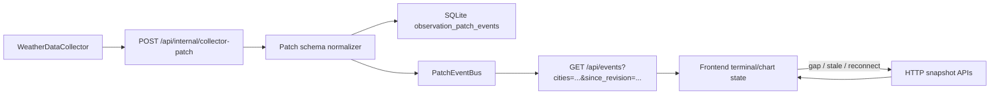

# Production Realtime SSE Patch Design

> 日期: 2026-05-26
> 范围: PolyWeather 网站终端图表的生产级实时观测增量层
> 目标服务器: 2 vCPU / 8 GB RAM / 50 GB 系统盘

## 背景

当前网站已经有 SSE patch 通道，但它更像一个进程内即时广播层：

- 后端 `web/sse_manager.py` 用进程内 `asyncio.Queue` 管连接。
- 采集器通过 `/api/internal/collector-patch` 推送城市温度变化。
- 前端 `use-sse-patches.ts` 用 `EventSource` 接收 patch，并把温度合并到终端列表和图表。

这个结构能做轻量实时更新，但还不是生产级“像股票行情一样”的实时架构。主要缺口是：

- 断线后没有 replay event log。
- 连接不能按城市订阅，只能广播后让前端筛选。
- patch schema 没有版本化，后续扩展跑道、站点、最高温字段风险较高。
- 多实例共享 pub/sub 还没有抽象边界。

## 目标

把当前实时层升级为“HTTP 快照基线 + SSE 增量观测事件 + 可重放事件日志”的架构：

- 页面首屏仍通过 HTTP snapshot 加载完整 terminal rows / city detail。
- 实测温度、站点观测、跑道观测通过 SSE 增量追加到图表。
- 浏览器断线重连后可以通过 `since_revision` 补发错过的事件。
- 前端只订阅当前可见城市，例如 2x2 图表中的四个城市。
- patch payload 明确使用 `city_observation_patch.v1` schema。
- 第一版用 SQLite event log 适配当前服务器规格，预留 Redis/Postgres event bus 接口。

## 非目标

第一版不做这些事：

- 不把全部 terminal state 改成 event sourcing。
- 不用 SSE 取代 `/api/scan/terminal` 或 `/api/city/{name}/detail`。
- 不在第一版强依赖 Redis。
- 不把 DEB、多模型、概率分布改成分钟级实时更新。
- 不做 WebSocket；继续使用 SSE，因为浏览器端简单、代理友好、适合单向行情流。

## 推荐架构



## 事件存储

新增 SQLite 表 `observation_patch_events`，由 `DBManager` 初始化。

字段：

- `revision INTEGER PRIMARY KEY AUTOINCREMENT`
- `schema_type TEXT NOT NULL`
- `schema_version INTEGER NOT NULL`
- `city TEXT NOT NULL`
- `source TEXT NOT NULL`
- `obs_time TEXT`
- `payload_json TEXT NOT NULL`
- `created_at TEXT NOT NULL`

索引：

- `idx_observation_patch_events_city_revision(city, revision)`
- `idx_observation_patch_events_created_at(created_at)`

保留策略：

- 默认保留 6 小时。
- event log 只用于 SSE 断线 replay，不作为日内历史曲线归档。
- 完整日内曲线仍由 `/api/city/{name}/detail` 从现有观测存储和 city cache 构建。
- 6 小时窗口覆盖浏览器短线重连、页面休眠恢复和用户午后交易窗口内的 replay；超过窗口直接触发 HTTP resync。
- 每次写入后低频触发清理，避免每条事件都扫表。
- 环境变量：`POLYWEATHER_PATCH_EVENT_RETENTION_HOURS=6`。

## Patch Schema v1

事件类型固定为：

```json
{
  "type": "city_observation_patch.v1",
  "revision": 12345,
  "city": "shanghai",
  "source": "amsc_awos",
  "obs_time": "2026-05-26T10:02:00Z",
  "ts": 1780000000000,
  "payload": {
    "temp": 30.4,
    "max_so_far": 31.0,
    "station_code": "ZSPD",
    "station_label": "Shanghai Pudong",
    "series_key": "airport_primary",
    "unit": "celsius",
    "runway_points": [
      {
        "runway": "17L/35R",
        "temp": 30.8,
        "tdz_temp": 30.5,
        "mid_temp": 30.6,
        "end_temp": 30.8,
        "is_settlement": true
      }
    ]
  }
}
```

兼容要求：

- 前端仍接受旧 `city_patch` 一段时间，避免部署顺序问题。
- 新事件统一转换成前端内部 `CityPatch`。
- 后端 ingest 接受旧字段 `changes`，但写入 event log 时规范化成 v1。

## SSE API

`GET /api/events`

查询参数：

- `cities`: 逗号分隔城市 key，例如 `shanghai,hong kong,taipei`
- `since_revision`: 客户端上次处理过的最大 revision
- `replay_limit`: 最大补发数量，默认 500，上限 2000

连接行为：

1. 建立连接。
2. 返回 `connected` event，包含当前 server revision。
3. 如果传入 `since_revision`，先从 SQLite 补发匹配城市的历史事件。
4. 进入 live stream，只推送匹配城市的事件。
5. 每 30 秒发送 heartbeat。

gap 处理：

- 如果 `since_revision` 太旧，超过保留窗口或补发上限，服务端发送：

```json
{
  "type": "resync_required",
  "reason": "replay_window_exceeded",
  "latest_revision": 12345
}
```

- 前端收到后对当前可见城市调用 HTTP full detail resync。

## 后端模块边界

新增或调整模块：

- `web/realtime_patch_schema.py`
  - 负责规范化旧 `city_patch` 输入为 `city_observation_patch.v1`。
  - 负责校验城市、温度、时间、source。

- `web/realtime_event_store.py`
  - 封装 SQLite event log 写入、查询、保留清理。
  - 使用 `DBManager` 的 DB path。

- `web/sse_manager.py`
  - 从纯进程队列升级为基于 `PatchEventBus` 的连接管理。
  - 保留进程内 live fanout。
  - 每个连接记录订阅城市集合。

- `web/routers/sse_router.py`
  - 解析 `cities`、`since_revision`、`replay_limit`。
  - ingest 后先写 event log，再广播 live event。

第一版 `PatchEventBus`：

- `SQLitePatchEventBus`
- 写入 SQLite event log。
- 进程内广播给当前 worker 的连接。

后续可新增：

- `RedisPatchEventBus`
- `PostgresPatchEventBus`

## 前端模块边界

调整：

- `frontend/hooks/use-sse-patches.ts`
  - 支持 `city_observation_patch.v1`。
  - 记录 `lastRevision`。
  - 支持按可见城市集合建立 SSE URL。
  - 收到 `resync_required` 时通知图表重拉。

- `frontend/components/dashboard/scan-terminal/use-scan-terminal-query.ts`
  - 继续负责 terminal rows 的 HTTP snapshot。
  - 消费 patch 时只更新轻量字段：当前温度、最高温、观测时间。

- `frontend/components/dashboard/scan-terminal/LiveTemperatureThresholdChart.tsx`
  - 消费 patch 时追加分钟级观测点。
  - 对 runway patch 更新对应 runway series。
  - resync required 或长时间无 patch 时重拉 `/api/city/{name}/detail`。

城市订阅策略：

- 2x2 / 3x3 图表只订阅当前 slots 中的城市。
- 移动端只订阅当前主图城市。
- 切换布局或城市后重建 SSE 连接。

## 数据流

### 首屏加载

1. 前端调用 `/api/scan/terminal` 得到 terminal rows。
2. 每个可见图表调用 `/api/city/{name}/detail` 得到完整基线曲线。
3. 前端用可见城市列表连接 `/api/events?cities=...&since_revision=...`。

### 新观测进入

1. `WeatherDataCollector` 发现温度或跑道观测变化。
2. POST `/api/internal/collector-patch`。
3. 后端规范化为 `city_observation_patch.v1`。
4. 写入 SQLite event log，生成 revision。
5. 广播给订阅该城市的 SSE 连接。
6. 前端追加图表点并更新 terminal row。

### 断线重连

1. 前端保留 `lastRevision`。
2. EventSource 断线后指数退避重连。
3. 重连 URL 带 `since_revision=lastRevision`。
4. 后端 replay missed events。
5. 如果 replay 不完整，返回 `resync_required`，前端 HTTP 重拉。

## 错误处理

- ingest payload 无 city 或无有效 temp/runway point：返回 400。
- event log 写入失败：返回 500，不广播，避免前端看到不可 replay 的事件。
- SSE replay 查询失败：发送 `resync_required`，然后继续 heartbeat/live stream。
- 前端收到未知 schema：忽略并记录 debug log。
- 前端 revision 倒退：忽略。
- 前端 revision 跳号：标记 gap，并触发 HTTP resync。

## 测试策略

后端：

- `tests/test_realtime_patch_schema.py`
  - 旧 `city_patch` 输入能规范化成 `city_observation_patch.v1`。
  - 跑道 payload 保留 runway point。
  - 无效 city/temp 返回校验失败。

- `tests/test_realtime_event_store.py`
  - append event 生成单调 revision。
  - replay 按 city 过滤。
  - retention cleanup 删除旧事件。

- `tests/test_sse_replay.py`
  - `/api/events?cities=...&since_revision=...` 只 replay 匹配城市。
  - replay window 超限返回 `resync_required`。

前端：

- `frontend/components/dashboard/scan-terminal/__tests__/ssePatchArchitecture.test.ts`
  - 确认 v1 schema、city subscription、since_revision URL 存在。

- `frontend/components/dashboard/scan-terminal/__tests__/temperatureDefaultVisibilityPolicy.test.ts`
  - 确认 patch 追加分钟级观测点。
  - 确认 runway patch 更新对应 runway series。

验收命令：

```powershell
pytest tests/test_realtime_patch_schema.py tests/test_realtime_event_store.py tests/test_sse_replay.py
cd frontend
npm run test:business
npm run typecheck
npm run build
```

## 部署与容量

当前服务器 2 vCPU / 8 GB / 50 GB 足够第一版 SQLite-first：

- 30 个高频城市，每分钟 1 条事件，约 43,200 条/天。
- 默认只保留 6 小时，约 10,800 条事件。
- payload 控制在 1-3 KB，SQLite event log 体积预计维持在几十 MB 内。
- PM 最高温预测市场不需要把当天所有 patch 都保留在 event log；超过 replay 窗口时用 HTTP detail 重建当前画面。

运行建议：

- SQLite 使用 WAL。
- event log 与现有 `POLYWEATHER_DB_PATH` 同库。
- 先保持单 backend worker，避免进程内 fanout 跨 worker 不一致。
- 多实例或多 worker 时再启用 Redis bus。

## 后续 Redis 扩展

当部署变成多实例或多 worker 后，新增 `RedisPatchEventBus`：

- SQLite 仍作为 replay log。
- Redis Pub/Sub 或 Redis Stream 负责跨实例 live fanout。
- 每个 worker 从 Redis 订阅 live event，再投递给本进程 SSE 连接。

这个扩展不改变前端协议。

## 验收标准

- 页面加载后可见图表只订阅当前城市。
- 高频城市新观测进入后，图表在无需手动刷新下追加新点。
- 浏览器断线重连后，能补齐断线期间的事件。
- replay 超窗时，前端自动 HTTP resync。
- 未订阅城市的事件不会推送到该连接。
- 旧 `city_patch` 输入在迁移期仍可用。
- 所有新增行为有自动化测试覆盖。
