# Redis Stream Realtime Event Architecture Design

> 日期: 2026-05-27
> 范围: PolyWeather 网站图表实时观测事件层
> 目标服务器: 2 vCPU / 8 GB RAM / 50 GB 系统盘

## 背景

当前实时层已经具备生产化雏形：

- 后端已有 `city_observation_patch.v1` schema。
- `web/realtime_event_store.py` 使用 SQLite 保存 `observation_patch_events`，支持 `since_revision` replay。
- `/api/events?cities=...&since_revision=...&replay_limit=...` 已经是前端 SSE 入口。
- 前端 `frontend/hooks/use-sse-patches.ts` 使用 `EventSource`，并按当前可见城市订阅。

这解决了单进程、单实例下的实时推送和短窗口 replay，但还不够“一步到位”：

- 多 worker / 多实例时，进程内广播不能共享。
- SQLite replay log 可以补数据，但不适合作为跨实例 live fanout。
- 服务重启、浏览器后台恢复、SSE 断线后，需要更稳定的事件源。
- 后续如果把采集器拆成独立进程，需要一个明确的后端事件总线。

## 目标

升级为“Redis Stream 主事件日志 + SSE 浏览器传输 + SQLite fallback”的架构：

- Redis Stream 是生产环境实时事件主通道。
- SSE 仍然是浏览器唯一实时入口。
- 前端协议保持 `city_observation_patch.v1`，不让浏览器感知 Redis。
- 继续使用 numeric `revision`，兼容现有前端 `since_revision` 逻辑。
- 支持按城市订阅、断线 replay、多 worker fanout。
- 事件只保留短窗口，默认 24 小时；生产不建议超过 24 小时。

## 非目标

这次不做以下事情：

- 不引入 Kafka、RabbitMQ 或复杂 consumer group。
- 不把天气历史数据全部 event sourcing。
- 不让浏览器直接连接 Redis。
- 不把 DEB 预测、模型曲线、概率分布都改成事件流。
- 不做永久行情归档；超过 replay 窗口时继续走 HTTP full detail resync。

## 推荐架构

```mermaid
flowchart LR
    Collector["WeatherDataCollector / city refresh"] --> Ingest["POST /api/internal/collector-patch"]
    Ingest --> Normalize["city_observation_patch.v1 normalizer"]
    Normalize --> Store["RealtimeEventStore interface"]
    Store --> Redis["Redis Stream: stream:city_observation"]
    Store --> SQLite["SQLite fallback: observation_patch_events"]
    Redis --> WorkerSub["Redis XREAD subscriber per API worker"]
    WorkerSub --> LocalFanout["Local SSE fanout"]
    SQLite --> ReplayFallback["SQLite replay fallback"]
    SSE["GET /api/events?cities=...&since_revision=..."] --> Browser["Frontend EventSource"]
    LocalFanout --> SSE
    Redis --> SSE
    ReplayFallback --> SSE
    Browser --> Chart["Chart applies patch"]
    Browser -->|resync_required| Detail["HTTP /api/city/{city}/detail"]
```



关键原则：

- Redis Stream 负责后端事件保存、短窗口 replay、多实例共享。
- SSE 负责服务端到浏览器的单向推送。
- SQLite 只做 fallback 和本地开发，不再作为生产主事件总线。
- 前端只认 patch event，不关心事件来自 Redis 还是 SQLite。

## 事件模型

继续使用现有 schema：

```json
{
  "type": "city_observation_patch.v1",
  "revision": 12345,
  "city": "taipei",
  "source": "cwa",
  "obs_time": "2026-05-27T10:00:00+08:00",
  "observed_at_utc": "2026-05-27T02:00:00Z",
  "observed_at_local": "2026-05-27T10:00:00+08:00",
  "city_local_date": "2026-05-27",
  "city_timezone": "Asia/Taipei",
  "source_cadence_sec": 600,
  "ts": 1780000000000,
  "payload": {
    "temp": 34.2,
    "max_so_far": 34.2,
    "station_code": "466920",
    "station_label": "中央气象署台北站",
    "series_key": "settlement",
    "unit": "celsius"
  }
}
```

`revision` 仍然是前端公开排序键，必须是全局单调递增整数。

Redis Stream 自身的 stream ID，例如 `1780000000000-0`，只作为后端内部定位信息，不暴露给前端作为主 revision。

## Redis Stream 设计

Stream key:

```text
stream:city_observation
```

Revision key:

```text
counter:city_observation_revision
```

每条 stream entry 字段：

- `revision`: 全局递增整数，公开给 SSE/前端。
- `type`: `city_observation_patch.v1`
- `city`: normalized city key。
- `source`: source code，例如 `cwa`, `metar`, `amos`, `amsc_awos`。
- `obs_time`: 原始观测时间。
- `payload_json`: compact JSON。
- `created_at_ms`: 写入 Redis 的 UTC epoch ms。
- `producer_id`: API worker / collector instance id，便于排查。

写入必须通过 Lua 脚本原子完成：

1. `INCR counter:city_observation_revision`
2. `XADD stream:city_observation MAXLEN ~ {maxlen} * revision ... payload_json ...`
3. 返回 `{revision, stream_id}`

原因：

- 避免 `INCR` 成功但 `XADD` 失败后造成非必要 gap。
- 让 revision 分配和事件入流成为一个原子操作。
- 保持现有前端 numeric `since_revision` 不变。

## Replay 策略

`GET /api/events` 收到 `since_revision` 后：

1. 读取 Redis Stream 最旧 entry，拿到 oldest revision。
2. 如果 `since_revision > 0` 且 `since_revision < oldest_revision - 1`，发送 `resync_required`。
3. 从 Redis Stream 顺序扫描事件。
4. 过滤 `revision > since_revision`。
5. 过滤 `city IN subscribed_cities`。
6. 返回最多 `replay_limit + 1` 条。
7. 如果超过 `replay_limit`，发送 `resync_required`，让前端 HTTP resync。

当前事件量很小，单个 stream 顺序扫描 24 小时事件是可以接受的：

- 30 城市 * 1 条/分钟 * 24 小时 = 43,200 条。
- replay 通常只发生在断线重连，不是高频查询。

如果后续城市量扩大，或者确实需要超过 24 小时的 replay，再加 per-city stream 或 Redis sorted index。

## Live Fanout

每个 API worker 启动一个 Redis subscriber loop：

```text
XREAD BLOCK 5000 STREAMS stream:city_observation {last_seen_stream_id}
```

读取到事件后：

1. 解析 `city_observation_patch.v1`。
2. 按本进程 SSE 连接的 `cities` subscription 过滤。
3. 推送给本进程匹配的浏览器连接。
4. 更新 worker 内存中的 `last_seen_stream_id`。

ingest endpoint 写入 Redis 后不直接广播本地连接，由 subscriber loop 统一 fanout。这样避免同一个 worker 上“写入后本地广播一次、subscriber 又广播一次”的重复事件。

前端仍然用 revision 去重。即使极端情况下收到重复 revision，也应忽略旧 revision。

## SQLite Fallback

保留当前 SQLite store，但角色调整为：

- 本地开发无需 Redis 时使用。
- Redis 不可用且允许降级时使用。
- 单实例临时运行时可用。

新增环境变量：

```text
POLYWEATHER_EVENT_STORE=redis
POLYWEATHER_EVENT_STORE_FALLBACK=sqlite
POLYWEATHER_REDIS_URL=redis://127.0.0.1:6379/0
POLYWEATHER_REDIS_STREAM_KEY=stream:city_observation
POLYWEATHER_REDIS_STREAM_MAXLEN=50000
POLYWEATHER_PATCH_EVENT_RETENTION_HOURS=24
POLYWEATHER_REDIS_REQUIRED=true
```

推荐生产策略：

- `POLYWEATHER_EVENT_STORE=redis`
- `POLYWEATHER_REDIS_REQUIRED=true`
- Redis 写入失败时 ingest 返回 503，不广播不可 replay 的事件。

推荐本地策略：

- 不配置 Redis，自动使用 SQLite。
- 或 `POLYWEATHER_EVENT_STORE=sqlite`。

## Redis 容量与配置

当前 VPS 可以跑本机 Redis。

建议：

```text
bind 127.0.0.1
protected-mode yes
appendonly yes
appendfsync everysec
maxmemory 512mb
maxmemory-policy noeviction
```

默认 `MAXLEN ~ 50000` 足够约 24 小时事件：

- 30 城市 * 1/min * 24h = 43,200 条。
- payload 约 1-3 KB，实际内存取决于 Redis Stream overhead。
- 512 MB Redis maxmemory 对当前事件量足够。

注意：这个事件流不是永久数据仓库。超过 24 小时窗口后，前端应 HTTP resync 当前城市 detail。

## 模块边界

新增/调整后端接口：

### `web/realtime_event_store.py`

定义统一接口：

```python
class RealtimeEventStore:
    def append_event(self, event: dict) -> dict: ...
    def replay_events(self, *, cities: set[str] | None, since_revision: int, limit: int) -> list[dict]: ...
    def replay_requires_resync(self, *, cities: set[str] | None, since_revision: int, replay_count: int, limit: int) -> bool: ...
    def latest_revision(self) -> int: ...
```

保留现有 SQLite 实现，新增 Redis 实现。

### `web/redis_realtime_event_store.py`

职责：

- Redis 连接与健康检查。
- Lua append script。
- Redis Stream replay。
- maxlen trim。
- entry 到 SSE event 的反序列化。

### `web/sse_manager.py`

职责：

- 管理本进程 SSE 连接。
- 记录每个连接订阅城市集合。
- 将 Redis subscriber 读到的 event fanout 给匹配连接。

### `web/routers/sse_router.py`

职责：

- `/api/internal/collector-patch` 规范化并写入 event store。
- `/api/events` 处理 connected、replay、heartbeat、live stream。
- 当 replay 不完整时发送 `resync_required`。

### 前端

前端原则上不需要大改：

- `use-sse-patches.ts` 继续使用 `EventSource`。
- `lastRevision` 仍然是 number。
- `resync_required` 继续触发当前可见城市 HTTP detail refresh。
- 继续按可见城市列表构建 `cities` 参数。

## 运行流程

### 首屏

1. 前端 HTTP 加载 terminal rows。
2. 可见图表 HTTP 加载 full detail。
3. 前端连接 `/api/events?cities=...&since_revision=...&replay_limit=500`。
4. 后端先 replay Redis Stream 中缺失事件，再进入 live stream。

### 新观测

1. 采集器产生 `city_patch` 或 v1 patch。
2. ingest endpoint 规范化成 `city_observation_patch.v1`。
3. Redis Lua script 写入 stream 并生成 revision。
4. 每个 API worker 的 subscriber loop 读到事件。
5. worker fanout 给订阅对应城市的 SSE 连接。
6. 前端 apply patch，图表无痛追加点。

### 浏览器后台恢复

1. EventSource 如果断线，前端按指数退避重连。
2. URL 带 `since_revision=lastRevision`。
3. Redis replay 补齐后台期间错过的事件。
4. 如果 revision 太旧或 replay 超限，前端收到 `resync_required`，HTTP 重拉 full detail。

## 错误处理

- Redis append 失败且 `POLYWEATHER_REDIS_REQUIRED=true`：ingest 返回 503，不广播。
- Redis append 失败且允许 fallback：写入 SQLite，并在 health 状态标记 degraded。
- Redis replay 失败：SSE 发送 `resync_required`，然后继续尝试 live stream。
- Redis subscriber loop 断开：指数退避重连；期间 SSE heartbeat 仍可维持连接，但不会有 live patch。
- 前端收到 revision 倒退或重复：忽略。
- 前端收到未知 event type：忽略并记录 debug。

## 监控与诊断

新增健康指标：

- 当前 event store mode: `redis` / `sqlite` / `degraded_sqlite`
- Redis ping latency
- latest revision
- stream length
- oldest revision
- subscriber connected
- SSE active connection count
- dropped/resync_required count

建议暴露到现有 health endpoint 或日志：

```json
{
  "realtime": {
    "store": "redis",
    "redis_connected": true,
    "stream_len": 43210,
    "latest_revision": 123456,
    "oldest_revision": 80200,
    "subscriber_connected": true,
    "sse_connections": 9
  }
}
```

## 测试策略

后端：

- Redis store append 会生成全局递增 numeric revision。
- Redis replay 支持 city 过滤。
- Redis replay 支持 `since_revision`。
- Redis replay 超出 retention/limit 返回 resync required。
- Redis 不可用时，根据 env 严格失败或 fallback SQLite。
- SQLite store 现有测试保持通过。
- SSE router 在 Redis store 下仍发送 connected、replay、heartbeat。

前端：

- `use-sse-patches.ts` 保持 `revision` numeric。
- 重连 URL 保留 `since_revision`。
- 收到 `resync_required` 会触发 visible city refresh。
- 重复 revision 不重复追加图表点。

验收命令：

```powershell
python -m pytest tests/test_realtime_patch_schema.py tests/test_realtime_event_store.py tests/test_sse_replay.py
python -m pytest tests/test_redis_realtime_event_store.py
cd frontend
npm run test:business
npm run typecheck
npm run build
```

## 迁移步骤

1. 保留现有 SQLite implementation，抽出 event store factory。
2. 新增 Redis implementation 和单元测试。
3. 新增 Redis subscriber loop，但先在本地开发环境跑。
4. `/api/events` 接入 event store factory。
5. 线上安装 Redis，只监听 `127.0.0.1`。
6. 先用 `POLYWEATHER_EVENT_STORE=redis`、`POLYWEATHER_REDIS_REQUIRED=false` 灰度。
7. 观察 stream length、latest revision、SSE error、resync count。
8. 稳定后切换 `POLYWEATHER_REDIS_REQUIRED=true`。
9. 保留 SQLite fallback 代码，但生产不主动降级，避免多实例状态分裂。

## 验收标准

- 断开浏览器网络 1-5 分钟后恢复，图表自动补齐期间 patch。
- 后台挂页面再回来，图表不需要等待 full loading 才更新当前点。
- 多 worker 下，任意 worker 写入的 patch 都能推到其他 worker 的 SSE 连接。
- `/api/events?cities=taipei,shanghai&since_revision=...` 只 replay 指定城市。
- Redis 重启后，前端收到 `resync_required` 并 HTTP 重建画面。
- 前端无需知道 Redis 存在。
- 现有 `city_observation_patch.v1` schema 不破坏。

## 结论

这是一种“一步到位但不过度设计”的方案：

- 一步到位的是事件契约、replay、跨实例 fanout 和生产部署边界。
- 不过度设计的是不用 Kafka、不做永久行情库、不重写前端协议。

对当前产品最关键的是：图表像股票行情一样无痛刷新，断线可补，后台恢复可追上，多实例以后不用再推倒实时层。
